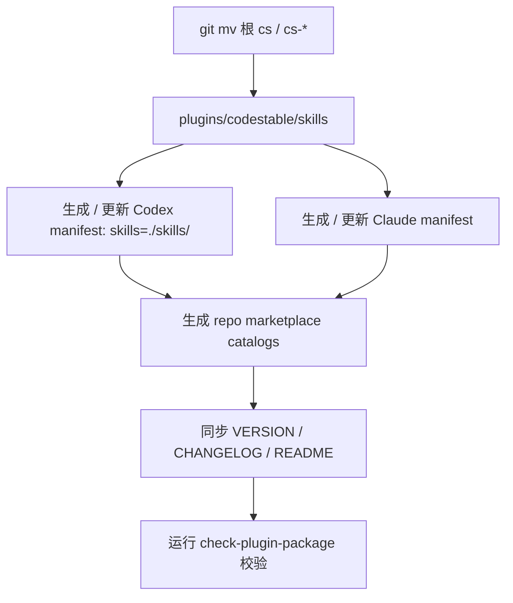

# plugin-market-distribution feature design

## 0. 术语约定

- **插件资产**：仓库中被安装器直接读取的已提交文件，不等于本地临时构建产物。
- **插件实体**：`plugins/codestable/`，Codex / Claude 安装后消费的 CodeStable 插件目录。
- **canonical skill 目录**：`plugins/codestable/skills/`，仓库内 `cs` / `cs-*` skill 的唯一源码位置。
- **平台 manifest**：Codex 的 `plugins/codestable/.codex-plugin/plugin.json`、Claude 的根 catalog `.claude-plugin/marketplace.json` 和插件内 manifest `plugins/codestable/.claude-plugin/plugin.json`。
- **版本权威**：根目录 `VERSION` 文件。防冲突：当前仓库没有 `VERSION` 或 `CHANGELOG.md`。

## 1. 决策与约束

### 需求摘要

把 CodeStable 仓库重组为可直接安装的 skill / plugin 分发结构：`plugins/codestable/` 是插件实体，`plugins/codestable/skills/` 是唯一 skill 源目录。成功标准是 Codex / Claude marketplace catalog 能指向该插件实体，`skills` CLI 能发现同一批 skill，manifest 版本一致，`cs*` skill 只维护一份，且校验命令能防止缺文件、错 schema、错版本和临时产物进入发布面。

明确不做：

- 不把仓库迁到 `codestable/codestable`。
- 不直接发布到公开 marketplace。
- 不把非 `cs*` skill 打进 CodeStable 插件。
- 不维护根目录 `cs*/` 与插件目录两套 skill 副本。
- 不在根目录保留 `cs*` symlink、stub `SKILL.md` 或 redirect 兼容层；路径变化通过 README / CHANGELOG 说明。
- 不兼容只扫描仓库根目录找 skill 的旧同步器；稳定入口只承诺 Codex marketplace、Claude marketplace 和 `npx skills@latest add`。
- 不保留未钉版本的旧 `npx skills add <repo>` 文案；README 需要更新为 `npx skills@latest add ...` 和 plugin marketplace 双入口。

### 复杂度档位

- Compatibility = cross-version：插件资产要同时适配 Codex、Claude 和 `skills` CLI。
- Public surface = stable：`VERSION`、manifest 字段、catalog 和 `plugins/codestable/skills/` 会成为发布接口。
- Validation = tested：必须有自动化测试覆盖目录迁移、manifest schema、版本一致性和安装可达性。

### 关键决策

1. 采用结构迁移而不是复制打包：根目录 `cs` / `cs-*` skill 移动到 `plugins/codestable/skills/`；仓库只保留这一份 canonical skill。
2. `plugins/codestable/` 直接作为可提交、可安装的插件实体；不使用被 ignore 的 `dist/` 作为安装资产路径。
3. Codex manifest 使用 `"skills": "./skills/"` 指向同级 `skills/`；不生成 `.codex/skills/`。
4. Claude catalog 指向 `./plugins/codestable`；插件实体内的 `.claude-plugin/plugin.json` 作为 Claude manifest，skills 由 `skills/` 目录约定发现，不额外复制到 `.claude/skills/`。
5. `skills@latest add owner/repo` 兼容性作为正式目标：`skills` CLI 会读取根 `.claude-plugin/marketplace.json` 并扫描插件实体的 `skills/`；README 同时给出 `npx skills@latest add liuzhengdongfortest/CodeStable` 和 `--full-depth` 兜底说明。
6. `VERSION` 是唯一版本权威；所有 manifest 的 `version` 由校验 / 生成脚本同步。
7. `.gitignore` 采用明确机制：仅把当前 `.claude` 改成 `/.claude/`，新增 `/dist/`，并保留既有 `__pycache__`、`*.pyc`、`.DS_Store`、`.codestable/` 忽略项。

### 执行风险与证据计划

- 风险 1：Claude 是否接受插件实体根下 `skills/` 目录而非 `.claude/skills/`。缓解：设计固定为第一版目标，实现测试至少校验 marketplace / manifest schema；若本地 Claude 试装失败，回滚到 `.claude/skills/` 前需重新 review。
- 风险 2：目录迁移遗漏局部资源。缓解：用 `git mv` 移动完整 `cs*` 目录，并用测试断言 `references/`、`reference/`、`agents/`、`tools/`、`hooks/`、`gates/` 等资源仍随 skill 保留。
- 风险 3：Codex / Claude catalog 或 manifest 字段不完整。缓解：`--check` 读取 JSON 精确字段并返回非零。
- 风险 4：`skills` CLI 兼容性被目录迁移破坏。缓解：在临时副本中运行 `npx skills@latest add . --list` 并验证输出包含 `cs`，同时断言原工作树状态未变化；真实安装命令只写入 README。
- 风险 5：活跃代码、测试或文档仍指向根目录 skill 或旧安装方式。缓解：grep README、README.en.md、CLAUDE.md、当前 feature、`.codestable/reference`、`tests/` 和工具脚本；只迁移路径型引用，不改流程节点 / skill 名称引用；README 主安装块只保留 `npx skills@latest add`，不展示旧 `npx skills add` 命令；历史 feature / acceptance / evidence 里的旧路径作为当时证据保留，不批量重写。
- 风险 6：仓库根仍有非 CodeStable skill（如 `browser-bridge`），`skills CLI --list` 可能一并列出。缓解：第一版只约束 `plugins/codestable/skills/` 不含非 `cs*`；README 用一句边界说明澄清仓库根其他 skill 不属于 CodeStable 插件资产。
- 风险 7：旧的根目录扫描器不再发现 `cs*` skill。缓解：README / CHANGELOG 明确迁移到 `plugins/codestable/skills/`，旧同步器需升级为读取 marketplace 或指定新路径。

Manifest version 路径：

- `plugins/codestable/.codex-plugin/plugin.json:version`
- `plugins/codestable/.claude-plugin/plugin.json:version`
- `.claude-plugin/marketplace.json:plugins[0].version`

Catalog 字段契约：

- `.agents/plugins/marketplace.json:name = "codestable"`，作为 Codex marketplace 名称。
- `.agents/plugins/marketplace.json:plugins[0].source = {"source":"local","path":"./plugins/codestable"}`
- `.agents/plugins/marketplace.json:plugins[0].policy.installation = "AVAILABLE"`
- `.agents/plugins/marketplace.json:plugins[0].policy.authentication = "ON_INSTALL"`
- `.agents/plugins/marketplace.json:plugins[0].category` 和 `plugins[0].interface.displayName` 必须存在。
- `.claude-plugin/marketplace.json:name = "codestable"`，`owner.name = "CodeStable"`，`description` 必须存在。
- `.claude-plugin/marketplace.json:plugins[0].source = "./plugins/codestable"`
- `plugins/codestable/.claude-plugin/plugin.json:author.name = "CodeStable"`
- `skills@latest` 兼容契约：根 `.claude-plugin/marketplace.json` 必须存在；`plugins[0].source` 指向插件实体；插件实体下必须有 `skills/<skill>/SKILL.md`。
- `skills@latest --list` 只要求能发现 `cs`；不要求列表只包含 `cs*`，因为仓库根可能暂时存在独立非 CodeStable skill。

必跑验证命令：

- `python3 tools/check-plugin-package.py`
- `python3 -m pytest tests/test_plugin_package.py`
- `python3 -m pytest tests/`
- `tmp=$(mktemp -d) && mkdir -p "$tmp/repo" && rsync -a --exclude '.git/' ./ "$tmp/repo/" && before=$(git status --short) && (cd "$tmp/repo" && npx skills@latest add . --list) && after=$(git status --short) && test "$before" = "$after"`
- `python3 .codestable/tools/validate-yaml.py --file .codestable/features/2026-07-01-plugin-market-distribution/plugin-market-distribution-checklist.yaml --yaml-only`
- `git diff --check`

交付物清单：`VERSION`、`CHANGELOG.md`、`.gitignore`、`.agents/plugins/marketplace.json`、`.claude-plugin/marketplace.json`、`plugins/codestable/`、`tools/check-plugin-package.py`、`tests/test_plugin_package.py`、README 安装说明更新、CLAUDE.md 路径口径更新、根目录 `cs*` skill 删除 / 迁移。

清洁度规则：不得提交临时 `dist/` 产物；不得新增调试输出、临时 TODO/FIXME、缓存文件或平台专用手写 skill 副本。

## 2. 名词与编排

### 2.1 名词层

现状：

- `cs*` skills 位于仓库根目录，如 `cs-feat-impl/`、`cs-roadmap-impl-goal/`，各自携带 `SKILL.md` 和局部资源。
- `browser-bridge/` 是仓库根的非 `cs*` skill，第一版不迁入 CodeStable 插件实体。
- README 仍使用 `npx skills add https://github.com/liuzhengdongfortest/CodeStable` 作为安装入口。
- Codex 官方插件结构要求插件目录带 `.codex-plugin/plugin.json`，repo marketplace 可放在 `.agents/plugins/marketplace.json`，插件 skill 目录可由 manifest `skills` 指定。
- `skills@1.5.14` 的发现逻辑会读取根 `.claude-plugin/marketplace.json`，按 `plugins[].source` 加入插件实体下的 `skills/` 搜索路径；`--full-depth` 可作为兜底深扫。
- baime 样例使用 `.claude/skills/`，但本设计选择更中性的 `plugins/codestable/skills/`，避免 Claude 命名污染 canonical 源目录。

变化：

- 新增 `PluginEntity`：`plugins/codestable/`，内部包含 `.codex-plugin/`、`.claude-plugin/`、`skills/` 和包内文档。
- `plugins/codestable/skills/` 成为唯一 skill 源；根目录不再保留 `cs*` skill。
- 新增 `VERSION`：bundle 级版本唯一来源，第一版建议 `0.1.0`。
- 新增 `CHANGELOG.md`：当前版本段定义为存在 `## 0.1.0` 或 `## [0.1.0]` 标题。
- 新增 `check-plugin-package` 命令：校验插件资产结构、manifest schema、版本和排除规则。

##### Interface 设计检查

- Module：插件资产校验器，全新。
- Interface：命令默认校验当前仓库；必须知道版本来源、canonical skill 路径、排除规则、Codex `skills` 指针和三个 version JSON 路径。
- Seam：CLI 命令是 seam；测试通过 fixture 或临时仓库根观察校验结果。
- Depth / locality：manifest 校验、ignore 兼容、目录结构和版本校验集中在校验器内部。
- Dependency strategy：in-process，本地文件系统生成，无远程依赖。
- Adapter：无；第一版不抽象 marketplace 发布 API。
- Test surface：通过 manifest、skill 文件、gitignore 可跟踪性、旧根目录残留和排除文件断言行为。

### 2.2 编排层

现状：没有统一插件入口；全局 skill repo 同步依赖根目录 skill 布局，README 的安装方式不是 Codex / Claude plugin market 体验。

变化：仓库源码结构直接变成可安装 skill / plugin 结构，不再通过复制生成第二份 skill 内容。

流程级约束：

- 迁移必须保留完整目录：每个 `cs*` skill 的局部资源跟随 `git mv`。
- 版本必须一致：三个精确 manifest version 路径都必须等于 `VERSION`。
- 包内容必须收敛：`plugins/codestable/skills/` 只包含 `cs` / `cs-*` 且含 `SKILL.md` 的目录；根目录不再有 `cs*` skill 目录、symlink、stub 或 redirect；非 `cs*` 根 skill 暂不纳入插件实体。
- 安装可达：Codex catalog 的顶层 `name` 必须是 `codestable`，`source` 必须是 `{"source":"local","path":"./plugins/codestable"}` 并带 `policy` / `category` / `interface.displayName`；Claude marketplace 的顶层 `name` / `owner` / `description` 必须通过 `claude plugin validate --strict`，`source` 必须是 `./plugins/codestable`；`skills` CLI 必须能发现至少 `cs` skill。
- 失败语义：缺 `VERSION`、非法 semver、缺 changelog 版本段、无 skill、manifest 不合法、插件资产被 ignore、根目录残留 `cs*` skill 都返回非零。

### 2.3 挂载点清单

- 插件资产校验命令：`tools/check-plugin-package.py` — 新增。
- 版本入口：`VERSION` — 新增。
- 变更记录入口：`CHANGELOG.md` — 新增。
- Codex marketplace catalog：`.agents/plugins/marketplace.json` — 新增并提交，供 `codex plugin marketplace add owner/repo` 发现插件。
- Claude marketplace catalog：`.claude-plugin/marketplace.json` — 新增并提交，供 `/plugin marketplace add owner/repo` 发现插件。
- 插件实体：`plugins/codestable/` — 新增并提交，包含 Codex manifest、Claude manifest、canonical skills 和包内文档。
- `.gitignore`：仅将 `.claude` 改为 `/.claude/` 并新增 `/dist/`，保留既有缓存 / `.codestable/` 忽略项；安装资产路径不依赖 ignore 反选。
- README / 活跃代码文档安装说明：`README.md` / `README.en.md` / `CLAUDE.md` / 当前结构说明 / `tests/` 路径引用 — 修改为 Codex / Claude plugin marketplace 与 `npx skills@latest add` 三入口；README 主安装块不保留旧 `npx skills add` 命令；CHANGELOG 说明根目录扫描器不再兼容；历史 `.codestable/features/*` 证据不批量改写。

### 2.4 推进策略

1. 目录迁移：用 `git mv` 把根 `cs` / `cs-*` 目录移动到 `plugins/codestable/skills/`。退出信号：根目录无 `cs*` skill，`plugins/codestable/skills/cs/SKILL.md` 存在。
2. 版本与 manifest 骨架：新增 `VERSION` / `CHANGELOG.md`、Codex / Claude manifest 和 marketplace catalog。退出信号：三条 version 路径和 catalog source 校验通过。
3. gitignore 与资产路径护栏：仅把 `.claude` 改成 `/.claude/`，新增 `/dist/`，保留既有 ignore 项，并确认 `.agents/`、`.claude-plugin/`、`plugins/codestable/` 可跟踪。退出信号：`git check-ignore` 不忽略安装资产路径。
4. 校验器与失败规则：新增根 `tools/check-plugin-package.py`（仓库发布校验工具，不属于 skill 运行时资产），覆盖 semver、changelog、schema、根目录残留、非 `cs*` skill、缓存和临时产物。退出信号：pytest 覆盖正常与错误场景。
5. 活跃引用接入：更新 README / README.en.md、CLAUDE.md、活跃结构说明、`tests/` 和工具脚本中的路径型引用，说明 Codex、Claude、`skills` CLI 安装、版本、旧入口变化、本地验证命令和非 `cs*` 根 skill 边界。退出信号：读者能从 README 找到当前 repo marketplace 和 `npx skills@latest` 安装方式，测试引用 `plugins/codestable/skills/cs-onboard/...` 而不是根 `cs-onboard/`，且 `python3 -m pytest tests/` 通过；历史归档不被批量改写。

### 2.5 结构健康度与微重构

##### 评估

- 文件级 — `README.md` / `README.en.md`：文档较长，但本次只改安装段，不需要拆分。
- 文件级 — 新增 `tools/check-plugin-package.py`：全新文件，不评估文件级健康。
- 目录级 — 根目录：当前有 30 个左右 skill 目录，发布结构会继续膨胀根目录；迁移到 `plugins/codestable/skills/` 可降低根目录噪声。
- 目录级 — `plugins/`：当前不存在，是稳定的可提交插件实体目录。
- 目录级 — `tests/`：已有 5 个同层测试文件，本次新增 1 个，不达到重组阈值。

##### 结论：做微重构（重组目录）

本 feature 的核心就是结构迁移：把根 `cs*` skill 目录移动到 `plugins/codestable/skills/`，保持每个 skill 包内相对路径不变。验证方式：`check-plugin-package`、pytest、`find . -maxdepth 1 -name 'cs*'` 无根目录 skill。

建议沉淀的 convention：CodeStable 以后以 `plugins/codestable/skills/` 作为唯一 skill 源目录；新增 cs skill 不再落根目录。

## 3. 验收契约

### 3.1 关键场景清单

- 正常：仓库内存在可提交的 `.agents/plugins/marketplace.json`、`.claude-plugin/marketplace.json` 和 `plugins/codestable/`。
- 正常：Codex catalog 顶层 `name` 为 `codestable`，`source` 对象指向 `./plugins/codestable`，并包含 `policy`、`category`、`interface.displayName`；Codex manifest 的 `skills` 固定为 `./skills/`。
- 正常：Claude marketplace 的顶层 `name`、`owner`、`description` 合法，`plugins[0].source` 精确等于 `./plugins/codestable`。
- 正常：在临时副本运行 `npx skills@latest add . --list` 能从 `plugins/codestable/skills/` 发现 `cs`，且原工作树状态不变。
- 正常：`VERSION=0.1.0` 时，三条 manifest version 路径都是 `0.1.0`。
- 正常：每个 `cs*` skill 位于 `plugins/codestable/skills/`，局部资源完整，且根目录不存在 `cs*` skill 目录。
- 边界：非 `cs*` skill（如 `browser-bridge`）不进入插件实体；若 `skills --list` 列出它，不视为本 feature 失败。
- 错误：缺少 `VERSION`、版本不是 semver、`CHANGELOG.md` 缺少当前版本段、manifest 不合法、资产路径被 ignore 或根目录残留 `cs*` skill 时，校验命令返回非零。

### 3.2 明确不做的反向核对项

- 代码中不应出现把远端仓库改成 `codestable/codestable` 的配置或文档要求。
- 活跃安装文档不应继续展示 `npx skills add <repo>` 命令；必须使用 `npx skills@latest add <repo>`。历史归档中的旧入口可保留。
- 生成资产不应包含 `browser-bridge/`、`.pytest_cache/`、`__pycache__/`、`*.pyc`、`.DS_Store`。
- 不应提交临时 `dist/` 产物；不应保留根目录 `cs*` skill 副本、symlink、stub 或 redirect 兼容层。

### 3.3 Acceptance Coverage Matrix

| Scenario | Covered By Step | Evidence Type | Command / Action | Core? |
|---|---|---|---|---|
| skill 目录迁移为单一源码 | S1 | command + diff | `python3 tools/check-plugin-package.py` | yes |
| Codex catalog 与 skills 指针 | S2 | test | `python3 -m pytest tests/test_plugin_package.py` | yes |
| Claude marketplace catalog | S2 | test | `python3 -m pytest tests/test_plugin_package.py` | yes |
| `skills` CLI 兼容发现 | S2/S5 | command | `npx skills@latest add . --list` | yes |
| 既有工具行为迁移无损 | S1/S5 | command | `python3 -m pytest tests/` | yes |
| version 一致 | S2 | test | `python3 -m pytest tests/test_plugin_package.py` | yes |
| gitignore 不吞安装资产 | S3 | command + test | `git check-ignore ...` / pytest | yes |
| 非 `cs*` 与缓存排除 | S4 | test | `python3 -m pytest tests/test_plugin_package.py` | yes |
| README 有使用入口 | S5 | diff review | 人工读 README 安装段 | no |

### 3.4 DoD Contract

| ID | 要求 | 证据 | 阻塞级别 |
|---|---|---|---|
| DOD-DESIGN-001 | design 和 checklist 通过 design review | design-review | blocking |
| DOD-IMPL-001 | 目录迁移、manifest、版本文件、文档和测试按 checklist 完成 | checklist / diff | blocking |
| DOD-REVIEW-001 | code review passed 且无 unresolved blocking | review report | blocking |
| DOD-QA-001 | QA 运行校验命令和测试 | QA report | blocking |
| DOD-ACCEPT-001 | acceptance 确认插件安装资产和 req 状态 | acceptance report | blocking |

Validation Commands:

| ID | 命令 | 目的 | 核心性 | 失败处理 |
|---|---|---|---|---|
| CMD-001 | `python3 tools/check-plugin-package.py` | 验证插件资产、manifest、目录迁移和排除规则 | core | fix-or-block |
| CMD-002 | `python3 -m pytest tests/test_plugin_package.py` | 验证校验器行为 | core | fix-or-block |
| CMD-003 | `python3 -m pytest tests/` | 验证既有工具、hooks、reference 路径迁移后仍可用 | core | fix-or-block |
| CMD-004 | `tmp=$(mktemp -d) && mkdir -p "$tmp/repo" && rsync -a --exclude '.git/' ./ "$tmp/repo/" && before=$(git status --short) && (cd "$tmp/repo" && npx skills@latest add . --list) && after=$(git status --short) && test "$before" = "$after"` | 隔离验证 `skills` CLI 兼容发现且原工作树无写入 | core | fix-or-block |
| CMD-005 | `python3 .codestable/tools/validate-yaml.py --file .codestable/features/2026-07-01-plugin-market-distribution/plugin-market-distribution-checklist.yaml --yaml-only` | 验证 checklist YAML；使用项目运行时副本，避免迁移后引用根 `cs-onboard/tools` | core | fix-or-block |
| CMD-006 | `git diff --check` | 检查空白和补丁格式 | core | fix-or-block |

Required Artifacts: design-review、review、QA、acceptance、命令输出摘要。

## 4. 与项目级架构文档的关系

本 feature 引入新的发布结构和版本权威。验收通过后：

- `plugin-market-distribution` req 从 `draft` 更新为 `current`。
- 若后续真的迁移到 `codestable/codestable` 或发布公开 marketplace，再单独写 ADR；本 feature 不提前拍板。
- README 安装说明需要区分 Codex / Claude marketplace 安装、`npx skills@latest add` 安装、本地构建校验和未来正式坐标。

## 5. 残余风险

- Claude 对 `plugins/codestable/skills/` 的约定支持需要实现阶段用本地试装或文档事实确认；若不支持，需要回到 design review 决定是否接受 `.claude/skills/`。
- `browser-bridge` 第一版仍可能被 `skills CLI --list` 发现；它不属于 CodeStable 插件实体，后续可单独决定是否拆成独立 plugin。
- `cs-code-review`、`cs-feat-design-review`、`cs-feat-qa`、`cs-goal`、`cs-roadmap-impl-goal`、`cs-roadmap-review` 等 skill 内嵌 `agents/` 为 Claude markdown；Codex 是否消费内嵌 markdown agents 第一版不验证。
