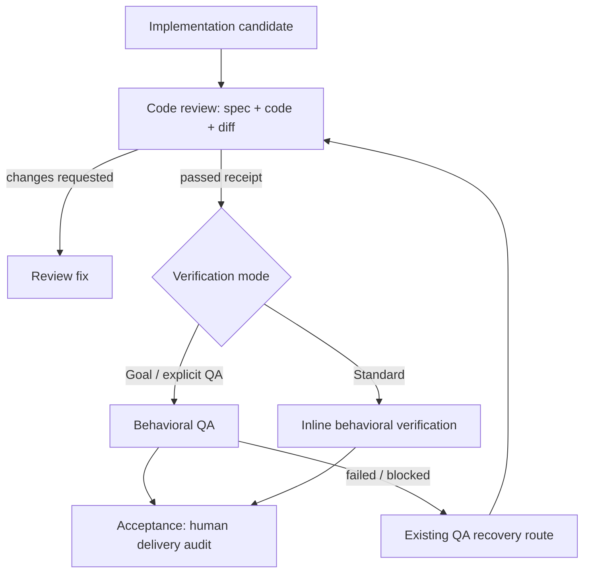

# Lean Workflow Artifacts

## 0. 术语约定

| 术语 | 定义 | 防冲突结论 |
|---|---|---|
| human document | 承载 owner 意图、设计理由、长期知识或最终交付结论，值得人长期阅读的文档 | 对应 design、requirement、ADR、approval、最终 acceptance；不是所有 Markdown |
| workflow receipt | 只为 gate、恢复和下一阶段投影必要事实的紧凑记录 | 沿用现有 canonical 路径和 frontmatter，不引入通用 receipt service |
| ephemeral transport | 只服务当前 run 或 agent 间传输、可从仓库事实重建的材料 | 包括 packet、raw reviewer 输出、完整成功日志和 diff 副本；默认不进入 unit |
| consumer projection | 某个消费者完成职责所需的最小 artifact 视图 | 不等于模型摘要；必要时必须回源 canonical 文档、代码或运行结果 |
| behavioral verification | 从用户、调用方或测试人员视角执行功能、集成、E2E、browser、API、CLI 或 manual 场景 | 属于 QA；不复判代码结构、风格或实现质量 |

## 1. 决策与约束

### 1.1 需求摘要

本 feature 服务 CodeStable 使用者和维护者：减少为了 agent 过程而生成的长文档、完整 packet 和重复证据，并让后续阶段只加载自身职责需要的信息。

成功标准：

- human document 仍完整落盘；workflow receipt 只保存 gate、恢复、开放问题和残余风险需要的字段。
- 同 workspace reviewer 默认只收到 locator、scope、changed paths 和验证引用，不接收重复内联的全部 unit 文档与 diff。
- passed review/QA 不再强制生成固定七节长报告；异常状态仍保留可恢复、可修复的细节。
- QA 默认以黑盒方式运行可观察行为场景，不默认读取实现源码、完整 diff 或 implementation 汇报，也不输出代码质量 finding。
- Standard 没有独立 QA artifact 时，accept-inline 复用同一 behavioral verification 契约，不把 acceptance 变成第二次 code review。
- 旧 review/QA/packet 继续可读，workflow resolver、doctor 和 Goal consistency 的既有结果不回退。

明确不做：

- 不删除、迁移或批量改写历史 artifact。
- 不取消现有 `{slug}-review.md`、Goal `{slug}-qa.md` 或 acceptance canonical 路径。
- 不新增 artifact database、持久 index、RAG、跨 workflow receipt store 或通用 runtime journal。
- 不新增 candidate/input digest wire contract；review freshness 继续由现有 code-review diff/round 契约负责。
- 不新增 QA `block_kind`、receipt consumption 状态或 Goal/Standard QA 路由；`passed|failed|blocked` 与现有 resolver 语义保持不变。
- 不改变 independent review 的 A/B 双环节结构与 gate 强度，不改变 owner checkpoint、Goal authorization、worktree/branch 策略。
- 不实现旧 roadmap 中的完整 decision/load-plan/InputIdentity runtime；本 feature 只做 protocol-level vertical slice。
- 不让 QA 通过读代码或 diff 来替代功能、集成或 E2E 行为验证。

### 1.2 复杂度档位

这是长期维护的 workflow 契约和 CLI 行为，按内部工具默认档位做真实实现，不使用 fake、临时 summary 文件或只靠提示词口号的占位方案。选择 Standard lane，因为改动横跨 review、QA、acceptance 和共享 runtime reference，但无需 Goal driver。

### 1.3 关键决策

1. **把持久化与加载深度分开判断。** artifact 是否落盘由未来消费者和不可重建性决定；消费者是否读全文由自身职责和 drill-down trigger 决定。
2. **v0.1 保留路径，只收紧语义。** resolver 继续识别现有 Markdown 路径和 `doc_type/status/reviewer`；review/QA report template 明确新增 compact-passed carve-out，保留完整 frontmatter 和各自下游 projection，非通过状态继续使用 detailed variant 保存开放 findings、阻塞原因和恢复引用。“没有 finding 写 none、不得删除章节”只约束 detailed variant。
3. **现有 gate reviewer 已直接回源；packet 优化只针对 file-handoff/remote。** 同 workspace 的独立 reviewer 当前已从 prompt locator 直接读仓库，不把它虚报为新增收益。`build-review-packet.py` 新增 workspace locator 与 scoped portable 能力，供确实构建 packet 的场景使用；缺省 `--transport=portable`，且没有新 flag 的 legacy unscoped 调用输出逐字节兼容，`--output <path>` 保持文件模式，只有 `--output -` 写 stdout。新 skill 调用必须给显式 include-path allowlist 并使用有限 validation tail；旧无 allowlist、完整 validation 行为只作兼容 fallback。
4. **Code review 与 QA 严格分工。** Code review 直接审 spec、代码与 diff，回答实现内部是否正确、安全、可维护；per-feature Cleanliness 由 code review、DoD cleanliness 与 final audit 承担，QA 不再重复。QA 面向候选版本执行行为场景，回答用户或调用方能否完成 design 承诺。
5. **QA 只消费行为风险投影，不新增恢复状态机。** review 向 QA 传 `status + review round/scope + qa_focus + residual_risks`；QA 不读取完整 review narrative。若现有 preflight 无法确认当前候选已有新鲜 review，QA 在写 terminal QA receipt 前回 `cs-code-review`，不自行读取 diff 做语义审查。测试失败需要诊断时才按 finding 范围读取日志、测试夹具或相关代码。v0.1 保持现有 `passed|failed|blocked` 与 resolver 路由，通过协议文本、scenario fixtures 和 dogfood read trace 约束读取边界，不宣称存在 runtime 级禁止读取机制。
6. **Standard inline 与 Goal QA 共用一个验证契约。** Goal QA 写 compact QA receipt；Standard acceptance 在缺少 passed QA 时按需加载同一 behavioral verification reference，并把结果直接写入 acceptance，不额外制造 QA 文档。
7. **Acceptance 是最终人类交付审计。** 它消费 code-review/QA projections、design 和仓库交付事实，负责 owner、requirement、roadmap 与知识收尾；不重复逐文件代码审查或 QA 清洁度扫描。
8. **重要中间结论必须晋升。** 影响设计的 finding 回写 design，结构性决策进入 ADR，可复用经验进入 compound；普通成功过程不靠长 history 文档保存。

### 1.4 风险、依赖与证据计划

Top 3 风险：

1. **投影过窄导致质量信息丢失。** 缓解：非 passed 状态、开放 finding、behavior-level QA focus 和 residual risk 必须保留；review round/scope 不可确认或状态冲突时 fail-closed 回 code review。
2. **QA 角色收紧后缺少可执行环境。** 缓解：环境、输入或可观察判据不足时沿用现有 `blocked` detailed report，行为不符合 design 时写 `failed`；不得退化成静态 code review 后宣称通过。
3. **新旧 artifact 兼容出现恢复分叉。** 缓解：不改 canonical 路径和既有 status；新增字段保持 additive；legacy full report 永久可读，runtime parity tests 锁定 resolver/doctor/Goal gate 输出。

非显然依赖：

- `codestable-workflow-next.py` 仍是机械 next-step resolver，本 feature 不替换它。
- review gate 仍依赖 `reviewer` 和独立 reviewer lane 状态；compact 不得删恢复字段。
- Goal consistency 仍要求 canonical review/QA/evidence artifact；v0.1 不删除这些文件。
- Standard 当前通过 accept-inline 完成行为验证；修改必须保持不新增强制 QA artifact。
- `workflow-next`、`restoreFeatureStage`、Goal QA loop 和 acceptance 当前对 `failed/blocked` 的恢复语义保持不变；本 feature 只用回归测试锁定，不增加分支。

关键假设：

- 现有 runtime 对 review/QA 正文没有通过所必需的深语义依赖；contract fixtures 已证明极短 artifact 可完成现有 gate。
- 同 workspace reviewer 能按 locator 自行读取仓库；remote reviewer 继续使用 portable transport。
- token 收益要以实际加载 bytes、packet bytes、输出 tokens 和调用次数证明，不能只以源码行数证明。

必跑验证命令见第 3.3 节。交付物包括共享 artifact 规则、review/QA/acceptance 协议、behavioral verification reference、packet transport、相关 README 表述和回归测试。不得新增调试输出、临时 TODO/FIXME、注释掉代码或无用途的兼容分支。

## 2. 名词与编排

### 2.1 名词层

**现状**

- `.codestable/reference/shared-conventions.md` 把 design/review/QA/acceptance 都描述为 feature spec，但没有统一区分 human document、workflow receipt 与 ephemeral transport。
- `cs-code-review/references/report-template.md` 为所有 verdict 固定完整报告章节；passed 也必须复述 diff、对抗过程和空 finding 分类。
- `cs-feat/references/qa/protocol.md` 已声明 QA 不是 code review，却仍默认读取实现汇报和完整 diff，并检查 TODO、unused import 等代码清洁度。
- gate 必需的同 workspace independent reviewer 已按 prompt locator 回源；`build-review-packet.py` 用于 file-handoff/remote 时只有 portable bundle，会内联 unit 全部 Markdown/YAML、完整 diff、全 worktree untracked 正文和 validation 文本。当前 dirty fixture 实测 packet 约 712KB，含 41 个与本 feature 无关的 untracked 文件。

**变化**

- 新增小型 `artifact-conventions` reference，按 `doc_type + consumer` 给出 persistence/read-depth 决策，不给每个 artifact 重复增加分类字段。
- review/QA report 改成 verdict-sensitive projection：passed 紧凑；changes/failed/blocked 保存开放项；pending 保存 lane/AgentRef/reason。
- compact passed review 的必填 frontmatter 保持 `doc_type`、来源 identity、`status`、`reviewer`、`reviewed`、`round` 及现有 lane state/ref/reason；行为级 `qa_focus/residual_risks` 是下游投影，旧 full report 继续可读。
- QA 只报告可观察行为失败或无法执行/判定的 blocker；代码质量问题必须回 code review。QA receipt 保持现有 `passed|failed|blocked` 和既有 frontmatter，passed 使用 compact projection，failed/blocked 使用 detailed variant 保存场景、期望、观察结果、环境/输入缺口和可复测步骤。
- packet CLI 增加 `workspace|portable` transport、显式 include-path allowlist 与 stdout 输出；workspace/scoped-portable 的 validation 保留有限 tail + 行数，digest 可选，不无限内联全文。legacy unscoped portable 继续保留原 validation 正文，避免兼容输出漂移。

接口示例：

```text
build-review-packet.py --root . --unit <feature> \
  --stage implementation --transport workspace --include-path <path> --output -

=> root + unit + selected spec paths + changed paths
   + validation refs + reviewer output contract
   # 来源：plugins/codestable/skills/cs-onboard/tools/build-review-packet.py main/build_packet
```

```markdown
---
doc_type: feature-review
feature: YYYY-MM-DD-slug
status: passed
reviewer: subagent
reviewed: YYYY-MM-DD
round: 1
lane_a_state: completed
lane_a_ref: "<agent-ref>"
lane_a_reason: ""
lane_b_state: skipped
lane_b_ref: ""
lane_b_reason: "provider policy"
---

## 4. Findings

none

## 5. Test And QA Focus

- S1 API happy path

## 6. Residual Risk

none

## 7. Verdict

- Status: passed
- Next: 按来源流程继续
```

上例是 feature 来源的 compact-passed 最小投影；其他来源替换 `doc_type` 与 identity 字段。所有现有 lane state/ref/reason 字段仍保留；detailed variant 继续保留全部固定章节与恢复事实。

Goal QA 的 compact-passed variant 保留 runner 恢复字段，并把成功命令与场景结果合并为 evidence locator，不复制完整输出：

```markdown
---
doc_type: feature-qa
feature: YYYY-MM-DD-slug
status: passed
runner_state: completed
runner_reason: ""
runner_id: "<runner-ref-or-empty>"
tested: YYYY-MM-DD
round: 1
---

## 1. Scope And Inputs

- Feature type: functional
- Core evidence gate: S1 API happy path

## 2. Verification Matrix

| ID | Action | Result | Evidence |
|---|---|---|---|
| QA-001 | `project test command` | pass | `<test-output locator>` |

## 5. Findings

- Open findings: none
- Residual risk: none

## 7. Verdict

- Status: passed
- Next: `cs-feat` acceptance stage
```

compact review/QA 都保留原模板节号，只省略非 projection 节；这样既减少正文，也不打断现有 QA/acceptance 对第 5/6/7 节的引用。failed/blocked QA 继续使用完整 detailed variant。

```text
QA(S1, current passed review projection)
  -> run API/CLI/browser/E2E action
  -> observed result matches expected
  -> BehavioralVerificationPassed
  # 默认不读取实现源码或 diff
```

Interface 设计检查：新增 CLI flag 是现有 packet builder 的自然扩展，调用者不需要理解 packet 内部组装；workspace/portable 是真实 transport seam。依赖仍限于标准库和既有 `codestable_common`，不新增 adapter 或第三方依赖。

### 2.2 编排层

**现状**

当前主链路是 `implementation -> code review full report -> QA/acceptance 重读 report + implementation + diff -> acceptance 再做 final audit`。代码事实、验证证据和过程 narrative 多次进入上下文，QA 与 code review 职责重叠。

**变化**



- Code review 自己读取 canonical spec、live code 和 diff；现有 gate reviewer 继续直接接收 prompt locator 并回源核验；只有 file-handoff/remote 调用者才构建 workspace/scoped-portable packet。
- Review writer 按 verdict 落 projection；raw reviewer narrative 在当前 run 合并后丢弃，material finding 晋升到 canonical artifact。
- Behavioral verification 从 design 第 3 节和项目测试入口建立矩阵；review projection 只补风险焦点，不主导测试范围。
- QA 默认执行黑盒场景。仅失败或 blocked 的诊断分支读取相关日志、fixture、配置或代码，诊断不转化为代码质量 review。
- Acceptance 先核验当前 code-review/QA receipt 状态，再消费已通过 QA 或运行 inline verification；review round/scope 无法证明当前时回 code review。随后处理 owner、requirement、roadmap 和知识收尾，不重复 code review。

流程级约束：

- **错误语义与恢复**：行为失败写现有 `failed`，环境、输入或可观察判据不足写现有 `blocked`，并在 detailed body 保存可复测信息；机械 next-step 沿用当前 Standard/Goal/acceptance 路由。review freshness 无法确认时在 terminal QA receipt 之前回 code review，因此不制造需要消费的新 blocked 状态。本 feature 不修复或扩展既有 QA recovery FSM。
- **幂等与恢复**：canonical 路径和 status 不变；pending lane 必须保留 ref/reason；仅当现有 review round/scope freshness 契约仍判定为 current 时复用 passed receipt。
- **顺序**：任何 qa-fix 改变候选后必须先重跑 code review，再重跑 QA；不得从 QA 直接修代码或越过 review。
- **按需加载**：artifact convention 只在决定写/读 artifact 时加载；behavioral verification 只在进入独立 QA 或 Standard inline verification 时加载。
- **可观测点**：packet transport、review round/scope、读取 projection、验证 scenario IDs、命令/动作结果、dogfood read trace 和 artifact bytes 都可在测试或 dogfood 中核对。read trace 是行为证据，不是 runtime sandbox。

### 2.3 挂载点清单

1. `plugins/codestable/skills/cs-onboard/references/artifact-conventions.md` -> `.codestable/reference/artifact-conventions.md`：新增并 runtime-sync 共享 artifact persistence/read policy。
2. `build-review-packet.py` CLI 与 `tools.md`：新增 workspace/scoped-portable transport、include-path、stdout 输出和兼容默认。
3. reviewer 派发契约：更新 `agent-conventions` file handoff，并在 `independent-review` 新增同 workspace 直接回源、remote/file-handoff 才用 portable 的说明。
4. `cs-code-review` report contract/template：新增 compact-passed carve-out，并向 QA 传行为风险投影。
5. `cs-feat` QA/implementation protocol：QA 改为 behavioral verification owner，新增 compact-passed QA carve-out，failed/blocked 保留 detailed variant；既有 QA resolver 与 Goal loop 不改。
6. `cs-feat` acceptance protocol/reference：Standard inline 按需复用 behavioral verification；同步 QA report 投影的章节引用，随后执行最终人类交付审计。

### 2.4 推进策略

1. **规则骨架**：建立 artifact admission 与 consumer projection 规则，并让相关 skill 指向同一权威。
   - 退出信号：contract tests 能区分 human document、workflow receipt、ephemeral transport 和 full/drill-down trigger。
2. **传输边界**：为 review packet 增加 workspace locator、scoped portable、include-path、stdout 和 validation 限长；同步 reviewer 派发/消费及 tools reference，并创建 `tests/test_review_packets.py`。
   - 退出信号：专用测试证明 workspace/scoped-portable 不包含 allowlist 外 sentinel，workspace 不含正文或 fenced code body，没有新 flag 的 legacy portable 逐字节兼容旧输出，reviewer 按 locator/remote 规则选择 transport。
3. **Review projection**：收紧 code-review 输入传递和 verdict-sensitive writer，在 report template 明确 compact-passed carve-out，保留 legacy reader 与恢复字段。
   - 退出信号：passed receipt 可通过既有 resolver并保留 reviewer/lane 锚点；detailed non-pass/open findings/pending lane 可恢复。
4. **Behavioral QA**：抽出 cs-feat 内部共用验证契约，重写独立 QA 输入、finding 和执行边界，让 Standard accept-inline 复用，并同步 implementation 与 acceptance 的投影引用。`cs-code-review` 只输出行为风险投影，不反向读取 cs-feat-local reference。
   - 退出信号：功能/E2E 场景能独立通过；passed compact 与 failed/blocked detailed report 均沿用现有 resolver 结果；contract/scenario tests 与 dogfood read trace 表明 QA 未执行代码审查职责。
5. **兼容与度量**：更新 README/reference/tests，运行 runtime parity、package、sync 和 dogfood 字节对比。
   - 退出信号：旧 artifact 行为不变，相关与全量验证通过，并有 before/after packet/artifact/read-set 数据。

### 2.5 结构健康度与微重构

##### 评估

- 文件级 — `cs-code-review/SKILL.md` 约 299 行：职责集中在 code review，但输入与报告说明偏长；本次替换旧段落，不继续扩写。
- 文件级 — `qa/protocol.md` 约 298 行：行为验证与代码清洁度混写；共用验证算法应移到独立 conditional reference，避免继续膨胀。
- 文件级 — `acceptance/protocol.md` 约 300 行：职责较多；本次只删除重复读取/验证规则并引用共用契约，不做结构性拆分。
- 文件级 — `build-review-packet.py` 约 235 行：workspace/portable 都属于 packet transport，同一模块可承担；若实现明显膨胀再按 serializer 拆分，不预先抽象。
- 文件级 — `codestable-workflow-next.py` 约 1900 行：它是兼容 resolver，本次不修改；只用现有测试和 compact fixture 证明 resolver 结果不回退。
- 目录级 — `cs-onboard/references/` 当前 13 个同层共享 reference；新增 1 个职责明确、命名唯一的文件，不满足本次新增两个以上或明显分组迁移条件。
- 目录级 — `cs-feat/references/qa/` 当前只有 protocol；新增一个 behavioral verification reference 正好形成职责分层，不需要额外子目录。

##### 结论：不做

本 feature 不做前置微重构。通过“替换重复段落 + 新增一个 conditional reference”控制文件增长；模块拆分、通用 receipt runtime 和目录重组属于后续独立工作。

## 3. 验收契约

### 3.1 关键场景

- **S1 Artifact admission**：当内容没有人类长期价值、gate/resume 消费者且可重建时，不创建 unit artifact；存在人类决策时仍生成完整 human document。
- **S2 Scoped transport**：同 workspace reviewer 启动时，只收到 allowlist 内 locator、scope、changed paths 和 validation refs，不出现 unit 文档、完整 diff、untracked 正文或完整日志；scoped portable 也不包含 allowlist 外 sentinel。
- **S3 Portable compatibility**：缺省 transport 仍是 portable，没有新 flag 的旧 unscoped 文件输出逐字节兼容；显式 scoped portable 保留 secret-like 脱敏/省略且不传无关文件。
- **S4 Review projection**：clean passed review 按 compact-passed template 写 receipt；changes-requested/blocked/pending 使用 detailed variant 保存开放 finding 或 lane 恢复事实；既有 full report 继续可读。
- **S5 QA behavior boundary**：QA 从 design 场景、运行入口和 review behavior-risk projection 建矩阵，执行功能/integration/E2E/browser/API/CLI/manual 证据；默认不读实现源码/完整 diff/implementation 汇报，不检查风格、TODO 或 unused import。
- **S6 QA verdict compatibility**：QA 继续只写 `passed|failed|blocked`；passed 使用 compact projection，failed/blocked 使用 detailed variant。Standard workflow-next、Goal loop、acceptance 与 legacy full QA 的现有路由结果不变。
- **S7 Standard inline**：Standard 缺 QA artifact 时按需运行同一 behavioral verification contract，结果直接进入 acceptance；不新增 QA 文档，也不重复 code review。
- **S8 Freshness ownership and legacy**：QA 不建立第二套 freshness 机制；当前 review round/scope 无法确认时回 code review。旧 full artifact 保持 legacy reader，不篡改历史完成状态。
- **S9 Evidence dedup**：Goal consumer 正常只读取 evidence pack projection；仅 failed/warning/digest mismatch 时下钻 raw DoD/gate JSON，不同时全文加载三份相同证据。

明确不做的反向核对：

- 仓库中不应出现新 artifact store、persistent index 或 runtime journal。
- `workflow-next`、doctor 和 Goal consistency 不应要求新的 canonical 文件名或新 status。
- QA 报告不应包含逐文件代码质量、style、dead import 或 diff review finding。
- Standard 不应因为本 feature 被强制新增 `{slug}-qa.md`。

### 3.2 Acceptance Coverage Matrix

| Scenario | Covered By Step | Evidence Type | Command / Action | Core? |
|---|---|---|---|---|
| S1 artifact admission | 1 | contract test | artifact policy classification assertions | yes |
| S2 scoped transport | 2 | tool test | workspace/scoped-portable allowlist + content absence assertions | yes |
| S3 portable compatibility | 2 | tool test | no-new-flag legacy portable byte-compatible golden + scoped secret assertions | yes |
| S4 review projection | 3 | contract + resolver tests | compact/legacy/non-pass fixtures | yes |
| S5 QA behavior boundary | 4 | scenario tests | functional/E2E QA fixture and forbidden-input assertions | yes |
| S6 QA verdict compatibility | 4 | resolver/contract scenario tests | compact passed + detailed failed/blocked + legacy route parity | yes |
| S7 Standard inline | 4 | workflow scenario | review passed -> inline behavioral verification -> acceptance | yes |
| S8 freshness ownership and legacy | 3, 5 | compatibility tests | current/uncertain review scope + legacy fixtures | yes |
| S9 evidence dedup | 3, 5 | contract tests | normal projection vs drill-down triggers | no |

### 3.3 DoD Contract

| ID | 要求 | 证据 | 阻塞级别 |
|---|---|---|---|
| DOD-DESIGN-001 | design/checklist 完整且独立 design review passed | design-review | blocking |
| DOD-IMPL-001 | checklist steps 全部完成，旧 artifact/runtime 兼容 | checklist + targeted tests | blocking |
| DOD-REVIEW-001 | 独立 code review passed，无 unresolved blocking | compact/full review | blocking |
| DOD-QA-001 | contract/scenario fixtures 验证 QA 协议边界与旧 verdict 路由兼容，并用 dogfood read trace 观察实际读取；不宣称 runtime 禁读 | behavioral verification evidence | blocking |
| DOD-ACCEPT-001 | acceptance 核对交付物、全量验证、runtime sync 和残余风险 | acceptance | blocking |

Validation Commands:

| ID | 命令 | 目的 | 核心性 | 失败处理 |
|---|---|---|---|---|
| CMD-001 | `python3 -m pytest -q tests/test_review_packets.py tests/test_skill_contract_semantics.py tests/test_skill_entry_simplification.py tests/test_reference_contract_classification.py tests/test_skill_workflow_scenarios.py tests/test_codestable_workflow_next.py tests/test_codestable_goal_consistency_gate.py tests/test_codestable_doctor.py` | hot-path contract、packet、resolver 和兼容回归 | core | fix-or-block |
| CMD-002 | `python3 -m pytest -q tests -rs` | 全量回归 | core | fix-or-block |
| CMD-003 | `python3 tools/check-plugin-package.py --root . --json` | 插件打包完整性 | core | fix-or-block |
| CMD-004 | `python3 plugins/codestable/skills/cs-onboard/tools/codestable-runtime-sync.py --root . --source-skill-dir plugins/codestable/skills/cs-onboard --check --json` | runtime manifest/reference 同步一致性 | core | fix-or-block |
| CMD-005 | `git diff --check` | patch 清洁度 | core | fix-or-block |

Required Artifacts: 本 design/checklist/design-review、共享 artifact reference、behavioral verification reference、协议/模板/README 更新、`tests/test_review_packets.py`、packet tool 变更、targeted/full test evidence、dogfood read trace 摘要、code review 和最终 acceptance。raw reviewer 输出、portable/workspace packet 实例和完整成功日志不进入 feature unit。

## 4. 与项目级架构文档的关系

本 feature 实现 draft requirement `demand-driven-skill-runtime` 中“按当前动作加载规则和证据”的最小 protocol slice。它不引入新领域实体、跨模块 runtime service 或难回退的架构选择，因此本轮不新增 CONTEXT 术语或 ADR。若后续把 compact receipt 升级为跨 workflow versioned wire schema，应另行 design 并重新判断 ADR。
