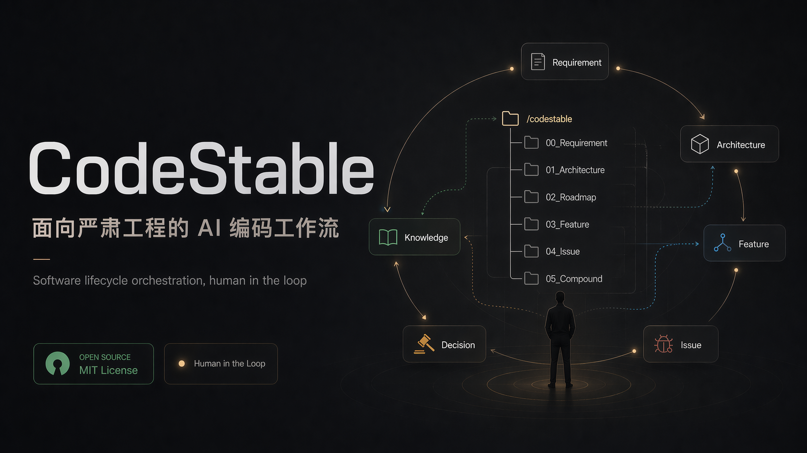

<div align="center">

# CodeStable



[English](./README.en.md) · **中文**

**面向严肃工程的 AI 编码工作流**

厌倦了 OpenSpec 的草台、Oh-My-OpenAgent 的过度设计、Superpowers 的散装——我从 0 写了一套简单轻巧、围绕**人在环**的 AI Harness。

<p>
  
    
</p>

</div>

---

## 安装

```bash
npx skills add https://github.com/liuzhengdongfortest/CodeStable
```

只需要一键，开始工作：

```bash
/cs-onboard
```

之后日常使用时，不知道该用哪个技能就喊根入口：

```bash
/cs
```

`cs` 会读你的诉求，告诉你这次该走哪个 `cs-xxx`。

---

## 缘起

我在开发一套新的 Harness Agent（[MA](https://github.com/liuzhengdongfortest/MA)），一开始当然是 VibeCoding——我只写设计和需求，代码由 AI 来改。这样支撑了大部分特性的开发。直到有一天 Codex 反复解决不了一个我认为比较简单的问题，并且反复在同一个地方犯错。我就知道项目需要一套工作流来维持它继续进行了。

我调研了 OpenSpec、SuperPowers、Oh-My-OpenAgent 这一类工具，没一个用着顺手：

- **OpenSpec** 太简单，没有复利工程，生成的 Spec 抽象到人类没法读
- **SuperPowers** 没有流程约束，不知道该用哪个
- **Oh-My-OpenAgent** 太重，且哲学上认为"人介入 = 失败"

CodeStable 的目标是**解决严肃工程的软件实现和编码问题**，不是造一个新名词、追求热点。

---

## 与其他框架的核心区别：编排的目标是谁

我看了一圈现在主流的 AI 编码框架——Superpowers、CCW、Oh-My-OpenAgent 等等——它们其实都在做**同一件事**：

> **如何把 Agent 编排得更好。** 让它们组队、协作、头脑风暴、跑流水线、自动接力。围绕的实体始终是 **Agent**。

CodeStable 走的是**另一个方向**：

> **编排的不是 Agent，而是软件本身的生命周期。** 围绕的实体是**构成软件的要素**——每一个变更、每一条取舍、每一个被否决的方案、每一条历史里留下来的约束。

<table>
<tr><th></th><th>Agent 编排派</th><th>CodeStable</th></tr>
<tr><td><b>核心实体</b></td><td>Agent / Role / Team</td><td>事项（issues / epics）· requirements（需求 / 约束 / 取舍）</td></tr>
<tr><td><b>主线问题</b></td><td>Agent 之间怎么分工、传递、协调？</td><td>软件的需求、约束、取舍怎么被记下来、被检索、被复用？</td></tr>
<tr><td><b>状态存在哪</b></td><td>Agent 的 session / 消息总线 / 队列</td><td><code>.cs/</code> 文件树（人和 AI 都能读）</td></tr>
<tr><td><b>解决的痛点</b></td><td>单 Agent 能力不够，需要协同放大</td><td>软件复杂度膨胀撑破上下文、隐知识丢失、需求漂移</td></tr>
<tr><td><b>对人的定位</b></td><td>人少介入越好，理想是全自动</td><td>人在环 —— 程序员对整体把控负责，AI 是高效的执行体</td></tr>
</table>


**这两个方向没有谁对谁错。**

如果你的任务是"用 AI 跑一个端到端的自动化产线"、"让多个 Agent 互相讨论方案"，Agent 编排派会更顺手。

如果你的任务是"维护一个会跨年迭代的严肃软件"、"让今天写下的需求和决策三个月后还能被准确召回"——那 CodeStable 这套以软件要素为中心的建模会更合适。

我做 CodeStable 是因为我相信：**软件工程的混乱本质上不是 Agent 不够强，而是要素没被组织好**。Agent 再强，也写不了一个把需求、取舍、历史决策全丢失的项目。

---

## 设计：事项 + requirements

早期 CodeStable 把开发拆成 6 个实体、3 条流水线。用下来发现实体太多、流程太硬——feature / issue / refactor 其实是同一种东西（可关闭的事项），requirements / roadmap / architecture 也都在描述需求、约束和取舍。于是收敛成**事项 + requirements**。

### 事项 —— 要做、做完会关闭的事

bug、重构、小功能、大需求，本质都是"一件要做、做完就关闭的变更"，只是大小和类型不同。它们落在 `.cs/issues/` 或 `.cs/epics/`。

- **`cs-plan`** —— 接住 `talks/`：小需求直接落成 issue，大需求先进 epic 规划并拆 issues
- **`cs-complain`** —— 行为不符合预期时，完成投诉建档、反馈回路、诊断、修复验证并回写 bug issue
- **`cs-design`** —— 针对单个 issue 做教程式实现设计：功能怎么分工、请求/数据怎么走、边界、改动路线和验证
- **`cs-test`** —— 可选测试设计：公司或用户需要时，为单个 issue 写测试目标、用例和执行方式
- **`cs-do`** —— 按 issue 的实现设计写代码、验证，并回写执行记录
- **`cs-close`** —— 关闭 issue：把毕业内容沉淀到 requirements、notes、facts 或 tools；git 仓库里连同代码和 issue 一起提交
- **`cs-issue`** —— 一件可关闭的变更，tag 分 `bug` / `refactor` / `feature` / `chore`。bug 由 `cs-complain` 跑完整诊断修复闭环，其余事项按设计 → 执行 → 关闭推进
- **`cs-epics`** —— 大到塞不进单条 issue 的：先在 epics 里定架构（模块拆分 + 接口契约），再拆成带依赖 DAG 的 issues
- **`cs-audit`** —— 主动扫描发现器 + 对账 requirements，产出 triage 清单，选中的升级成 issue

### requirements —— 用人话说明当前需求

这是 CodeStable 的北极星：**读它即知代码背后的需求、约束与取舍**。它不是字段表，而是一组面向人的说明：背景是什么，大致要实现什么功能，为什么这样、为什么不那样，哪些用户故事必须守住，哪些边界会变化。

requirements 按“主文档统帅、子文档分治”组织：`.cs/requirements/index.md` 先写背景、目标、统一术语、核心规则和子文档索引；复杂子系统、子步骤、题型或领域规则拆成同目录下的独立 requirements 子文档。

- **`cs-wiki`** —— 自动多轮结构性提问，派 subagent 调查，建设 `.cs/wiki/` 和 requirements 候选；不直接改 requirements
- **`cs-requirements`** —— 当前需求说明、领域词汇、关键规则和取舍（背景 / 功能 / 边界 / 为什么需要灵活性）。不引用代码位置、不记历史叙事

### 二者怎么咬合

事项是增量，requirements 是这些增量沉淀出的当前需求真相。**一个 issue 或 epic 关闭时，把毕业的约束、事实和取舍回写 requirements。** requirements 不记历史（那在关闭的 issue 里），issue 不长期描述当前需求。执行纪律（`cs-do`）和知识笔记（`cs-note`）服务两者。

---

## 技能总览

<table>
<tr><th>分组</th><th>技能</th><th>用途</th></tr>
<tr><td><b>根入口</b></td><td><code>cs</code></td><td>统一入口——介绍体系 + 把开放式诉求路由到正确的 cs-* 子技能。不知道用哪个就喊它</td></tr>
<tr><td><b>接入</b></td><td><code>cs-onboard</code></td><td>把 CodeStable 接入仓库：创建或补齐 <code>.cs/</code> 工作区和基础实体目录</td></tr>
<tr><td><b>讨论入口</b></td><td><code>cs-talk</code></td><td>想法模糊或信息缺失时的讨论 + 整理：先查仓库上下文，聊清楚后写入 <code>talks/</code></td></tr>
<tr><td><b>投诉入口</b></td><td><code>cs-complain</code></td><td>行为不符合预期时，建 bug issue，建立反馈回路，诊断根因，修复验证并回写</td></tr>
<tr><td><b>计划入口</b></td><td><code>cs-plan</code></td><td>读取 <code>talks/</code>，判断直接进入 issue 还是先进入 epic，并生成对应草案</td></tr>
<tr><td><b>设计入口</b></td><td><code>cs-design</code></td><td>面向单个 issue 做教程式实现设计，写回功能分工、请求/数据流、边界、改动路线和验证</td></tr>
<tr><td><b>测试入口</b></td><td><code>cs-test</code></td><td>可选关卡：需要测试设计时，为单个 issue 写测试目标、用例和执行方式</td></tr>
<tr><td><b>执行入口</b></td><td><code>cs-do</code></td><td>按 issue 的实现设计写代码、验证，并回写执行记录</td></tr>
<tr><td><b>关闭入口</b></td><td><code>cs-close</code></td><td>关闭 issue，沉淀稳定结论；git 仓库里连同代码和 issue 一起提交</td></tr>
<tr><td><b>系统理解</b></td><td><code>cs-wiki</code></td><td>自动多轮结构性提问，建设 <code>.cs/wiki/</code> 和 requirements 候选</td></tr>
<tr><td rowspan="3"><b>事项</b></td><td><code>cs-issue</code></td><td>一件可关闭的变更：bug / 重构 / 小功能 / 杂务，tag 分类型</td></tr>
<tr><td><code>cs-epics</code></td><td>大需求：先进 epics 定架构（模块拆分 + 接口契约），再拆成带依赖的 issues</td></tr>
<tr><td><code>cs-audit</code></td><td>主动扫描发现 + 对账 requirements，产出候选变更</td></tr>
<tr><td><b>需求</b></td><td><code>cs-requirements</code></td><td>用综述和子模块说明当前需求、领域词汇、关键规则和取舍</td></tr>
<tr><td rowspan="2"><b>辅助资料</b></td><td><code>cs-note</code></td><td>坑点 / 技巧 / 调研 / 命令陷阱等写入 <code>notes/</code>，一两行启动必读事实写入 <code>facts.md</code></td></tr>
<tr><td><code>cs-maketools</code></td><td>人带 AI 跑通未知流程，沉淀 notes、facts 引用和可选 tools</td></tr>
<tr><td><b>原则</b></td><td><code>cs-how-docs</code></td><td>把 wiki、requirements、notes、README 等组织成可阅读的知识空间，而不是平铺内容</td></tr>
<tr><td rowspan="2"><b>对外文档</b></td><td><code>cs-doc-tutorial</code></td><td>对外的开发者指南 / 用户指南（任务导向，怎么用 X 做 Y）</td></tr>
<tr><td><code>cs-doc-api</code></td><td>从源码反推的 API 参考（逐条目，给读者查零件）</td></tr>
</table>

---

## 工作流示意

CodeStable 不是一条线性流水，而是**事项 + requirements + 事件驱动**的：

```
═══════════════════════════════════════════════════════════════
 根入口 · 路由                            （任何时刻都可调用）
   cs ──▶ 介绍体系 / 把开放式诉求路由到下面的子技能
═══════════════════════════════════════════════════════════════
                          │
        ┌─────────────────┼─────────────────┐
   （未接入）          （想法模糊）        （已接入）
   cs-onboard         cs-talk ─▶ cs-plan ─▶ cs-design ─▶ cs-test? ─▶ cs-do ─▶ cs-close   直达事项 / requirements
   搭骨架              查上下文 + 整理 talks → 生成事项 → 设计 issue → 可选测试 → 执行验证 → 关闭沉淀
                       cs-complain ─▶ 行为跑偏时完成 bug 诊断修复闭环
═══════════════════════════════════════════════════════════════
 事项 · 要做、做完会关闭的事           （.cs/issues/ 或 .cs/epics/）
───────────────────────────────────────────────────────────────
   cs-plan   ──▶ 从 talks 判断：直接 issue，或先进 epic 再拆 issues
   cs-complain ─▶ 行为不符合预期时，反馈回路 → 诊断 → 修复验证 → 回写 bug issue
   cs-design ──▶ 针对单个 issue 做实现设计（功能分工 / 请求数据流 / 边界 / 改动路线 / 验证）
   cs-test   ──▶ 可选测试设计（目标 / 用例 / 层级 / test-first）
   cs-do     ──▶ 按 issue 写代码、验证、回写执行记录
   cs-close  ──▶ 关闭 issue，把毕业内容沉淀到长期实体，并提交代码 + issue/.cs 回写
   cs-wiki ─▶ 多轮结构性提问 + subagent 调查 → 系统 wiki + requirements 候选
   cs-issue  ──▶ 一件可关闭的变更（bug / 重构 / 小功能 / 杂务）
   cs-epics  ──▶ 大需求：先进 epics 定架构 → 拆成带依赖的 issues
   cs-audit  ──▶ 主动扫描 + 对账 requirements → 候选 issue
        │   写代码靠 cs-do（漂移那刻停）
        ▼   关闭时把毕业的取舍回写 ▼
═══════════════════════════════════════════════════════════════
requirements · 需求、约束、取舍        （.cs/requirements/）
───────────────────────────────────────────────────────────────
   cs-requirements ──▶ index 主文档 + 子文档说明 + 领域词汇 + 取舍
                       （背景 / 功能 / 关键规则 / 边界）
                       北极星：读它即知代码背后的需求与取舍
   cs-wiki ──▶ .cs/wiki/ + requirements-drafts（候选，不直接写 requirements）
═══════════════════════════════════════════════════════════════
            ▼ 任意时刻"这个值得记下来" ▼
 辅助资料 · 知识沉淀（复利工程）
   cs-note ──▶ .cs/notes/ 或 .cs/facts.md
   cs-maketools ─▶ 人带 AI 跑通未知流程 → notes + facts 引用 + 可选 tools
═══════════════════════════════════════════════════════════════
```

**怎么读这张图：**

- **事项和 requirements 不是时间顺序**——事项随时开新的，requirements 随事项关闭被刷新
- **事项是增量，requirements 是沉淀**：一个 issue 或 epic 关闭时把毕业的取舍回写 requirements
- **辅助资料是飞轮**：任何事项跑完发现"这事值得记下来"都能触发沉淀，沉淀又被下一次同类工作读到——这是 CodeStable "复利"的物理实现

---

## 运行时结构

`/cs-onboard` 跑完后，会在你的项目根下生成 `.cs/`——所有本地产物的聚合根，也是各子技能运行时唯一会读写的工作区。

```
你的项目/
├── .cs/
│   ├── facts.md              # 启动必读事实
│   ├── talks/                # 讨论整理（cs-talk，lazy）
│   │   └── YYYY/MM/DD/{status}-{slug}.md
│   │
│   ├── issues/               # 小事项，按创建日期分片，文件名 open-{slug}.md / closed-{slug}.md
│   │   └── YYYY/MM/DD/{slug}.md
│   ├── epics/                # 大事项规划
│   │   └── YYYY/MM/DD/{slug}.md
│   │
│   ├── requirements/         # 当前需求、约束和取舍（cs-requirements）
│   │   ├── index.md          # requirements 主文档：背景 / 目标 / 术语 / 子文档索引
│   │   └── {slug}.md         # 一块一篇
│   │
│   ├── wiki/                 # 系统 wiki 和 requirements 候选（cs-wiki）
│   │   ├── index.md
│   │   ├── map.md
│   │   ├── questions.md
│   │   ├── requirements-drafts.md
│   │   └── topics/{slug}.md
│   │
│   ├── notes/                # 知识笔记，纯 markdown，全文检索（cs-note）
│   │   └── YYYY/MM/DD/{slug}.md
│   │
│   └── tools/                # 跨工作流共享脚本（cs-maketools 按需沉淀）
│
└── （事项默认留在 .cs/，方便人和 AI 一起读写）
```

**几条要点：**

- 所有本地产物聚在 `.cs/` 下，"上次那个变更当时怎么搞的"三秒能找到
- `requirements/` 用人话说明当前需求、约束、领域词汇和取舍；`index.md` 统帅背景、目标和子文档索引，细节按子模块/题型渐进披露；历史在关闭的 issue 里
- `wiki/` 是自动建设的系统理解 wiki 和 requirements 候选库，候选需要人审阅后再进入正式 requirements
- talks / epics / notes 默认写入 `YYYY/MM/DD/{slug}.md` 日期分片，issues 写入 `YYYY/MM/DD/{status}-{slug}.md`；查找时递归搜索对应目录
- `notes/` 是知识笔记，纯 markdown 无 frontmatter，靠全文检索——好写好搜；日常“记下来”统一走 `cs-note`
- `cs-maketools` 会把人带路跑通的未知流程写入 `notes/`，在 `facts.md` 加引用，必要时再沉淀到 `tools/`
- 单个 Markdown 超过 150 行时，优先按渐进式披露拆到同目录资源，不为降行数硬压缩入口文件

### 硬约束

> Skill 是独立安装单元，运行时**每个 skill 只能看到自己包内的文件**。A 技能的 SKILL.md 里写 `B-skill/reference/xxx.md` 这种引用在运行时**根本读不到**。
>
> 跨 skill 的体系口径不要靠互相引用文件解决；放在 `cs` 技能自身，或沉淀成项目里的 `.cs/requirements/`、`.cs/notes/`、`.cs/facts.md`。

各 cs 行动技能开始前都先复用当前上下文：`cs`、`facts.md`、requirements 主文档等已经读过且无修改迹象，就不要机械重读；没读过、疑似变化、需要精确引用/写回，或需要新增局部时才补读。目标 issue、准备写回的 `.cs` 文件和代码文件，写入前必须确认当前版本。

要改体系口径，更新 `cs` 技能及其 references/templates；项目自己的稳定需求和操作经验，放回 `.cs/` 对应实体。

---

## 设计哲学

CodeStable 与 OMO 做的是**完全相反**的哲学。

- OMO 认为：人只要干预就是失败的信号
- CodeStable 认为：**程序员是软件编码中的在环对象**——可以对黑盒实现不了解，但对整体实现必须有所把控，必要时也可深入

软件架构必须要 **可演进**、**可观测**、**可控制**。

也许这一点在 AI 发展强大以后会变得不再重要，但**当下这样做能让程序员在现状下舒服**——这就是价值所在。

CodeStable 面向真实开发场景，对此进行建模，期望通过一个闭环系统处理开发中常见的问题。**现有大部分框架围绕 AI 建模，而不是围绕人。** 我认为这些框架的作者驱动 AI 的能力很强，但绝对不是严肃软件的开发者——因为缺少对软件开发中需求和设计的基础组织能力，缺乏对代码实现的尊重。

---

## Roadmap

CodeStable 会根据模型能力的发展进行调整。如果未来某个模型做到某个模块的稳定产出，那么这个模块就可以删除。

- [ ] 本地事项流打磨
- [ ] `cs-audit` 对账 requirements 的能力强化
- [ ] ……

欢迎在 Issue 区贴你的真实开发困境和重构经验。

---
## Star History

[](https://www.star-history.com/?repos=liuzhengdongfortest%2FCodeStable&type=date&legend=top-left)

<div align="center">

MIT License · 作者 [@liuzhengdong](https://github.com/liuzhengdongfortest)

</div>
