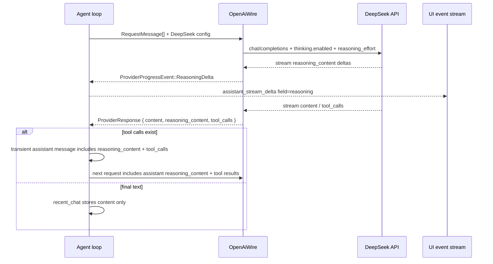

# DeepSeek Thinking Provider Design

> Stage 1 | 2026-04-25 | 上游：[deepseek-thinking-provider-brainstorm.md](deepseek-thinking-provider-brainstorm.md)

## 0. 术语约定

| 术语 | 定义 | 防冲突结论 |
|---|---|---|
| **DeepSeek Thinking Mode** | DeepSeek 官方 OpenAI-compatible Chat Completions API 的思考模式，使用 `thinking: { type }` 控制开关，使用 `reasoning_effort` 控制强度。 | grep 命中集中在本 feature、`reasoning.md` 和 provider preset；现有架构里旧称是 DeepSeek-R1 / InlineTag，需要更新为官方 Thinking Mode。 |
| **`reasoning_content`** | DeepSeek assistant message / stream delta 中与 `content` 同级的可见思考内容。 | 代码里目前只在 `openai_message_text` fallback 里读取，容易把 reasoning 当正文；本 feature 明确它不是正文。 |
| **Visible Reasoning Delta** | provider 层向 agent/UI 发送的思考增量，对应 UI 事件 `assistant_stream_delta { field: "reasoning" }`。 | 前端和 UI 事件类型已经有 `reasoning` 字段；后端缺 `ProviderProgressEvent` / `AgentProgressEvent` 链路。 |
| **Turn-scoped provider history** | `AgentSession::run_agent_loop` 中的 `transient_messages`，只在当前 Turn 的多次 LLM 请求之间存在，Turn 结束后丢弃。 | 与 `recent_chat` 不冲突；DeepSeek tool-call 后必须回传的 reasoning 只能放在这里。 |
| **DeepSeek V4 models** | 官方当前模型 ID：`deepseek-v4-flash` / `deepseek-v4-pro`。 | 现有内置表仍有 `deepseek-chat` / `deepseek-coder`；`deepseek-chat` / `deepseek-reasoner` 作为兼容 alias 可保留但不再作为主推。 |

## 1. 决策与约束

### 需求摘要

**做什么**：把 DeepSeek 官方 OpenAI-compatible API 接成 March 的正式 provider 能力，覆盖：

1. 普通 DeepSeek chat 请求可用。
2. DeepSeek V4 Thinking Mode 请求体正确发送 `thinking` / `reasoning_effort`。
3. 流式和非流式响应都能把 `reasoning_content` 映射到 March 的 reasoning UI，而不是混入正文。
4. DeepSeek 在工具调用后的官方约束被满足：带 tool calls 的 assistant message 在当前 Turn 后续请求里完整回传 `reasoning_content`。
5. 内置 DeepSeek preset / 模型能力更新到官方 V4 模型。

**为谁**：March 用户和维护者。用户能在设置里选 DeepSeek provider 后正常跑 agentic coding；维护者能继续复用现有 OpenAI-compatible wire 层，不为 DeepSeek 复制一套 provider 分支。

**成功标准**：

1. DeepSeek preset 默认 base URL 为 `https://api.deepseek.com`，suggested models 主推 `deepseek-v4-flash` / `deepseek-v4-pro`。
2. `vendor_preset_id = "deepseek"` + Chat Completions 请求在 thinking 开启时包含：
   ```json
   {
     "thinking": { "type": "enabled" },
     "reasoning_effort": "high"
   }
   ```
3. DeepSeek stream chunk 中的 `delta.reasoning_content` 产生 `assistant_stream_delta { field: "reasoning" }`；`delta.content` 继续产生 `field: "content"`。
4. 非流式 response 的 `message.reasoning_content` 进入 `ProviderResponse.reasoning_content` 和 debug payload；如果这一轮最终无工具调用，最终写入 `recent_chat` 的仍只有 `content`。
5. 一轮 DeepSeek 工具调用链路中，第一次 assistant tool-call message 带回 `reasoning_content`；第二次 provider request 的 `messages` 中保留该字段，避免 400。
6. 单元测试覆盖 request body、stream parse、non-stream parse、tool-call transient message serialization；`cargo test -p march-core provider` 或等价定向测试通过。

**明确不做**：

- 不接 DeepSeek Anthropic API 格式；本 feature 只覆盖 OpenAI-compatible Chat Completions。
- 不新增 `Protocol::DeepSeek` 或独立 `DeepSeekWire`；DeepSeek 继续走 `Protocol::OpenAi`。
- 不做全局 reasoning 设置 UI 重做；只接入最小必要的 DeepSeek request 参数和后端/UI 事件链路。
- 不把 `reasoning_content` 写入 `recent_chat`、Notes、Memory 或最终 assistant text。
- 不支持 `<think>...</think>` fallback 的新解析器；本 feature 针对 DeepSeek 官方 `reasoning_content` 字段。旧 fallback 可留给后续通用 reasoning feature。
- 不在 Thinking Mode 下继续承诺 `temperature` / `top_p` / penalty 生效；DeepSeek thinking 请求不发送这些采样参数。

### 挂载点清单

- `crates/march-core/src/settings/vendor_preset.rs`：修改 DeepSeek preset 默认端点、suggested models、probe model。
- `src/lib/providerBaseUrl.ts`：修改 DeepSeek 设置页默认端点预览，保持前后端默认一致。
- `crates/march-core/src/model_capabilities.json`：修改/追加 DeepSeek V4 模型能力。
- `crates/march-core/src/provider.rs`：修改 `RuntimeProviderConfig` / `ProviderResponse` / `ProviderProgressEvent`，承载 reasoning 请求参数与响应内容。
- `crates/march-core/src/provider/messages.rs`：修改 `RequestMessage` / `RequestOptions`，承载 assistant `reasoning_content` 和 DeepSeek thinking request policy。
- `crates/march-core/src/provider/wire.rs`：修改 OpenAI Chat Completions request/response/stream parser，处理 `thinking`、`reasoning_effort`、`reasoning_content`。
- `crates/march-core/src/provider/wire/shared.rs`：修改 OpenAI message serialization / content parsing，禁止把 `reasoning_content` fallback 成正文。
- `crates/march-core/src/provider/delivery.rs`：修改 stream collector，分别累积 content 与 reasoning，并向上游发送 reasoning delta。
- `crates/march-core/src/agent/runner.rs`：修改 agent loop，把 provider reasoning delta 转成 agent event；tool-call 后追加 assistant transient message 时带回 reasoning。
- `crates/march-core/src/agent/prompting.rs`：修改 `append_assistant_tool_call_message` 签名，把 `reasoning_content` 写入轮内 assistant tool-call message。
- `crates/march-core/src/ui/backend/messaging.rs`：修改 agent event → UI event 和 persisted timeline reducer，写入 `PersistedAssistantMessage.reasoning`。
- `crates/march-core/src/ui/types/events.rs`：若新增 agent event 不影响 UI enum，则只复用现有 `UiAssistantStreamField::Reasoning`；不新增 UI event 类型。
- `codestable/architecture/reasoning.md`：更新 DeepSeek 行为为官方 Thinking Mode。
- `codestable/architecture/provider.md`：补充 DeepSeek 是 OpenAI ChatCompletions vendor-specific policy 的例子。
- `codestable/architecture/DESIGN.md`：把总入口里旧的“DeepSeek-R1 inline tag”表述更新为“DeepSeek Thinking Mode / reasoning_content”。

### 复杂度档位

本 feature 走“项目内部核心 provider 能力”档位，偏离默认内部工具组合如下：

- 健壮性 = L3（偏离默认 L2 的原因：provider wire format 是外部输入边界，解析错会导致正文丢失、tool loop 400 或 UI 误展示）
- 结构 = modules（偏离默认 functions 的原因：`delivery.rs` 551 行、`messages.rs` 490 行、`agent/runner.rs` 399 行，本 feature 若继续内联会加重职责混杂；需要把 reasoning parsing / serialization 的核心规则收敛到小 helper）
- 可测试性 = tested（偏离默认 testable 的原因：DeepSeek tool-call 回传约束靠人工 review 很难发现，必须有 request serialization 单测）
- 兼容性 = backward-compatible（新增 V4 主推模型时保留旧 `deepseek-chat` / `deepseek-reasoner` alias；用户已有 provider 不需要迁移）

### 关键决策

**决策 1：DeepSeek 不新增协议，只新增 vendor-specific Chat Completions policy**

DeepSeek 仍是 `Protocol::OpenAi` + `vendor_preset_id = "deepseek"`。OpenAI ChatCompletions adapter 在构建请求时读取 `RuntimeProviderConfig.vendor_preset_id`，只对 DeepSeek 插入 `thinking` / `reasoning_effort`，并在 Thinking Mode 下跳过不生效的采样参数。

被拒方案：新增 `Protocol::DeepSeek` 或 `DeepSeekWire`。这会破坏 provider 架构里“协议决定 wire adapter，厂牌决定兼容策略”的分层，后续每个 OpenAI-compatible 厂牌都会诱导新增 adapter。

**决策 2：新增显式 reasoning 字段，不再把 `reasoning_content` fallback 成正文**

现有 `openai_message_text` 在正文为空时会尝试读取 `reasoning_content`。本 feature 删除这条 fallback：`content` 只来自 `content`，`reasoning_content` 进入独立字段。这样才能保证 thinking 内容不会进入最终 assistant text / recent_chat。

**决策 3：轮内回传放在 `RequestMessage.reasoning_content`**

给 `RequestMessage` 增加：

```rust
pub struct RequestMessage {
    pub role: String,
    pub content: Option<MessageContent>,
    pub reasoning_content: Option<String>,
    pub tool_call_id: Option<String>,
    pub tool_calls: Vec<ApiToolCallRequest>,
}
```

OpenAI ChatCompletions 序列化 assistant message 时，如果 `reasoning_content` 非空，就写成：

```json
{
  "role": "assistant",
  "content": "...",
  "reasoning_content": "...",
  "tool_calls": [...]
}
```

该字段只在 Turn-scoped provider history 中使用；`build_messages(context)` 从 `recent_chat` 构造历史时不填它。

**决策 4：Provider / Agent / UI 三层都用显式 reasoning delta**

新增 `ProviderProgressEvent::ReasoningDelta(String)` 和 `AgentProgressEvent::AssistantReasoningPreview { message_id, delta }`。UI 层复用现有 `UiAssistantStreamField::Reasoning`。这样 DeepSeek stream path 和前端既有 reducer 对齐，不需要新 UI 事件。

**决策 5：非流式 reasoning 不伪装成 stream，但要补到 UI 和 debug**

非流式 fallback 没有实时 delta。provider 返回后，agent runner 在处理最终 response 时，如果 `response.reasoning_content` 非空且当前 message 的 reasoning preview 还没覆盖，就补发一次 `AssistantReasoningPreview`，类似现有 `flush_missing_assistant_text_delta`。debug payload 同时保留 `reasoning_content`，方便排查 DeepSeek 400。

**决策 6：DeepSeek thinking 请求默认启用 high**

本 feature 不做完整 reasoning UI，所以默认策略是：

- `vendor_preset_id = "deepseek"` 且模型为 `deepseek-v4-flash` / `deepseek-v4-pro`：发送 `thinking.enabled` 和 `reasoning_effort = "high"`。
- 若将来 task run params 支持 `reasoning_enabled=false`，OpenAI wire policy 直接映射为 `thinking.disabled`。
- 若将来 task run params 支持 `max`，OpenAI wire policy 直接映射为 `reasoning_effort = "max"`。

这让本 feature 先完整跑通 Thinking Mode + tool calls，同时不给 UI 大改背债。

**决策 7：工具调用参数增量不在本 feature 补**

现有 provider stream 已能发 `ToolCallsUpdated`，但 UI 事件里 `tool_call_arguments` 的逐片段展示没有完整接上。DeepSeek 正式可用不依赖 UI 实时展示 arguments；只要最终 tool call arguments 完整进入 `ProviderResponse.tool_calls` 即可。本 feature 不顺手重做工具参数流式 UI。

### 主流程概述



关键异常/边界：

- DeepSeek 返回 `reasoning_content` 但 `content` 为空且无 tool calls：不能把 reasoning 当最终回答；保持现有 “no tool calls and no text” 错误。
- DeepSeek 返回 tool calls 且 `reasoning_content` 为空：仍允许继续，按普通 OpenAI-compatible tool call 处理。
- stream 中同一 chunk 同时包含 `reasoning_content` 和 `content`：分别 emit 两个 delta，顺序为 reasoning 后 content，保证 UI 不丢字段。
- 非 DeepSeek OpenAI-compatible provider 返回 `reasoning_content`：解析为 reasoning delta / response 字段，但不发送 DeepSeek `thinking` request 参数。

## 2. 接口契约

### 2.1 RequestMessage：轮内 assistant reasoning 回传

```rust
let message = RequestMessage::assistant_tool_calls_with_text_and_reasoning(
    Some(MessageContent::from_text("I will inspect the file.")),
    Some("I need to read the target file before editing.".to_string()),
    vec![tool_call],
);
```

序列化为 OpenAI ChatCompletions：

```json
{
  "role": "assistant",
  "content": "I will inspect the file.",
  "reasoning_content": "I need to read the target file before editing.",
  "tool_calls": [
    {
      "id": "call_1",
      "type": "function",
      "function": {
        "name": "read_file",
        "arguments": "{\"path\":\"src/lib.rs\"}"
      }
    }
  ]
}
```

```rust
// 来源：crates/march-core/src/provider/messages.rs RequestMessage
// 来源：crates/march-core/src/provider/wire/shared.rs serialize_openai_message
// 来源：crates/march-core/src/agent/prompting.rs append_assistant_tool_call_message
```

错误路径示例：来自 `recent_chat` 的 assistant final text 不应带 `reasoning_content`：

```json
{
  "role": "assistant",
  "content": "Done."
}
```

```rust
// 来源：crates/march-core/src/provider/messages.rs build_messages
```

### 2.2 DeepSeek request policy

DeepSeek V4 thinking 请求：

```json
{
  "model": "deepseek-v4-pro",
  "messages": [
    { "role": "user", "content": "Use a tool if needed." }
  ],
  "stream": true,
  "thinking": { "type": "enabled" },
  "reasoning_effort": "high",
  "max_tokens": 384000
}
```

约束：

- Thinking Mode 下不发送 `temperature`、`top_p`、`presence_penalty`、`frequency_penalty`。
- `max_tokens` 仍可发送。
- 非 DeepSeek provider 不受此 policy 影响。

```rust
// 来源：crates/march-core/src/provider/wire.rs OpenAiWire::build_request
// 来源：crates/march-core/src/provider/messages.rs RequestOptions
```

禁用 thinking 的未来兼容形态：

```json
{
  "thinking": { "type": "disabled" }
}
```

本 feature 不要求 UI 暴露禁用入口，但 request builder 的 helper 应能表达该状态，避免后续再改 wire contract。

### 2.3 Stream parse：reasoning 与正文分流

输入 SSE data：

```json
{
  "choices": [
    {
      "delta": {
        "reasoning_content": "I should inspect the config first."
      }
    }
  ]
}
```

输出：

```rust
vec![WireStreamDelta::ReasoningDelta(
    "I should inspect the config first.".to_string()
)]
```

UI event：

```json
{
  "kind": "assistant_stream_delta",
  "field": "reasoning",
  "delta": "I should inspect the config first."
}
```

输入正文 SSE data：

```json
{
  "choices": [
    {
      "delta": {
        "content": "I'll read the config now."
      }
    }
  ]
}
```

输出 `WireStreamDelta::ContentDelta(...)`，UI event 的 `field` 为 `"content"`。

```rust
// 来源：crates/march-core/src/provider/wire.rs OpenAiWire::parse_stream_event
// 来源：crates/march-core/src/provider/delivery.rs StreamCollector::ingest_delta
// 来源：crates/march-core/src/ui/backend/messaging.rs send_agent_progress_event
```

### 2.4 Non-stream parse：response 保留 reasoning

输入：

```json
{
  "choices": [
    {
      "message": {
        "role": "assistant",
        "reasoning_content": "Need current date first.",
        "content": "Let me check.",
        "tool_calls": [
          {
            "id": "call_date",
            "type": "function",
            "function": { "name": "get_date", "arguments": "{}" }
          }
        ]
      }
    }
  ]
}
```

输出：

```rust
WireResponse {
    reasoning_content: Some("Need current date first.".to_string()),
    content: Some("Let me check.".to_string()),
    tool_calls: vec![WireToolCall { id: "call_date", name: "get_date", arguments_json: "{}" }],
}
```

```rust
// 来源：crates/march-core/src/provider/wire.rs OpenAiWire::parse_response
// 来源：crates/march-core/src/provider/delivery.rs build_provider_response_from_wire_response
```

主要错误路径：

```json
{
  "choices": [
    {
      "message": {
        "role": "assistant",
        "reasoning_content": "I know the answer.",
        "content": "",
        "tool_calls": null
      }
    }
  ]
}
```

结果：`ProviderResponse.content == None` 且 `tool_calls` 为空，agent runner 报错，不把 reasoning 当 final text。

### 2.5 Persisted/UI timeline：reasoning 只进消息展示，不进 recent_chat

Agent event：

```rust
AgentProgressEvent::AssistantReasoningPreview {
    message_id: "assistant-message-1".to_string(),
    delta: "Need current date first.".to_string(),
}
```

Persisted timeline 更新：

```rust
message.reasoning.push_str(delta);
```

UI event：

```json
{
  "kind": "assistant_stream_delta",
  "message_id": "assistant-message-1",
  "field": "reasoning",
  "delta": "Need current date first."
}
```

```rust
// 来源：crates/march-core/src/ui/backend/messaging.rs apply_agent_progress_to_persisted_timeline
// 来源：crates/march-core/src/ui/types/events.rs UiAssistantStreamField
```

前端已有契约：

```ts
if (event.field === 'reasoning') {
  message.reasoning += event.delta
}
```

```ts
// 来源：src/composables/chatRuntime/chatEventReducer.ts applyAgentEventToTimeline
```

### 2.6 DeepSeek preset 与模型能力

DeepSeek preset：

```rust
VendorPreset {
    id: "deepseek",
    display_name: "DeepSeek",
    protocol: Protocol::OpenAi,
    default_base_url: "https://api.deepseek.com",
    suggested_models: &[
        "deepseek-v4-flash",
        "deepseek-v4-pro",
        "deepseek-chat",
        "deepseek-reasoner",
    ],
    probe_model: "deepseek-v4-flash",
    // ...
}
```

模型能力：

```json
{
  "deepseek-v4-flash": {
    "context_window": 1000000,
    "max_output_tokens": 384000
  },
  "deepseek-v4-pro": {
    "context_window": 1000000,
    "max_output_tokens": 384000
  }
}
```

能力限制：

- `supports_tool_use = true` 应由 settings model 能力默认值或用户选择体现；当前 `model_capabilities.json` 只包含 token 能力，本 feature 不扩展该 JSON schema。
- `reasoning` capability 若代码尚未实现 schema，design 不要求把 `ReasoningCapability` 写入 JSON；DeepSeek thinking policy 先基于 `vendor_preset_id` + model id 识别。

```rust
// 来源：crates/march-core/src/settings/vendor_preset.rs VENDOR_PRESETS
// 来源：crates/march-core/src/model_capabilities.json
// 来源：src/lib/providerBaseUrl.ts providerBaseUrlDefaults
```

## 3. 实现提示

### 目标文件状况评估

目标文件总体能接住 feature，但应做最小必要拆分：

- `provider/delivery.rs` 约 551 行，同时负责 HTTP、SSE、stream collector、debug response、stream capability cache。新增 reasoning 后，collector 逻辑应保持小而集中，不再把 content/reasoning/tool_calls 全散在 match 分支里。
- `provider/messages.rs` 约 490 行，承担上下文消息构造和 tool/server tool 辅助函数。新增 `reasoning_content` 时只改 RequestMessage 构造与 serialization 所需字段，不在这里塞 DeepSeek policy。
- `agent/runner.rs` 约 399 行，已有 tool loop 编排。新增 reasoning preview 和 tool-call transient 回传时，优先加小 helper（如 flush reasoning delta / build assistant tool transient），避免 loop 主干继续膨胀。

### 改动计划

1. **新建/调整 provider reasoning 数据结构**
   - 在 `ProviderResponse` / `WireResponse` 增加 `reasoning_content: Option<String>`。
   - 在 `WireStreamDelta` 增加 `ReasoningDelta(String)`。
   - 在 `ProviderProgressEvent` 增加 `ReasoningDelta(String)`。
   - 在 `DebugStructuredProviderResponse` 增加可选 `reasoning_content`。

2. **扩展 RequestMessage 轮内 reasoning 回传**
   - 给 `RequestMessage` 增加 `reasoning_content: Option<String>`。
   - 所有构造函数默认 `None`。
   - 新增 assistant tool-call 构造 helper，允许传 `content + reasoning_content + tool_calls`。
   - `serialize_openai_message` 对 assistant message 序列化 `reasoning_content`。

3. **实现 DeepSeek OpenAI ChatCompletions request policy**
   - 增加 helper：`is_deepseek_vendor(config)`、`is_deepseek_v4_model(options.model)`、`deepseek_thinking_policy(...)`。
   - DeepSeek V4 默认发送 `thinking.enabled` + `reasoning_effort = "high"`。
   - DeepSeek Thinking Mode 下跳过 temperature/top_p/penalty 字段；非 DeepSeek 保持现状。
   - 更新 preset default base URL / suggested models / probe model；同步前端 default URL。

4. **实现 OpenAI-compatible reasoning parse**
   - `parse_response` 从 `message.reasoning_content` 填 `WireResponse.reasoning_content`，正文只读 `content`。
   - `parse_stream_event` 解析 `delta.reasoning_content` 为 `WireStreamDelta::ReasoningDelta`。
   - 删除 `openai_message_text` 的 reasoning fallback，或拆成 `openai_message_content` + `openai_message_reasoning_content`。

5. **打通 Provider → Agent → UI 的 reasoning delta**
   - `StreamCollector` 分别累积 `reasoning_content` 与 `content`。
   - stream 时发送 `ProviderProgressEvent::ReasoningDelta`。
   - agent runner 转成 `AssistantReasoningPreview`。
   - messaging 层转成 `UiAssistantStreamField::Reasoning`，并更新 persisted timeline 的 `message.reasoning`。
   - 非流式 fallback 后补发缺失 reasoning delta。

6. **修正 tool-call 后的 transient message**
   - agent runner 调用 `append_assistant_tool_call_message` 时传入 `response.reasoning_content`。
   - 下一轮 provider request 中 assistant tool-call message 包含 `reasoning_content`。
   - 确保 final message 写入 `recent_chat` 仍只用 `content`。

7. **更新架构文档与测试**
   - 更新 `reasoning.md`、`provider.md`、`DESIGN.md` 中 DeepSeek 表述。
   - 增加单元测试：request body、stream reasoning parse、non-stream parse、tool-call transient serialization、DeepSeek preset 默认值。
   - 跑 `cargo test -p march-core provider`；若测试分组不存在，跑相关 crate 定向测试或 `cargo test -p march-core`。

### 实现风险与约束

- 不得把 `reasoning_content` 当正文 fallback；这是本 feature 最大 correctness 风险。
- DeepSeek tool-call assistant message 即使 `content` 为空，也要能和 `reasoning_content + tool_calls` 一起序列化。
- 非 DeepSeek OpenAI-compatible provider 若偶然返回 `reasoning_content`，可以展示 reasoning，但不能自动发送 DeepSeek `thinking` request 参数。
- `request_json` debug 必须反映真实发送 body，方便检查 thinking 字段和是否跳过采样参数。
- 旧 `deepseek-chat` / `deepseek-reasoner` 不移除，避免用户已有模型配置突然不可选；但 suggested models 排序把 V4 放前面。
- 官方文档显示 `deepseek-chat` / `deepseek-reasoner` 将于 2026-07-24 停用；测试不要把这两个 alias 当唯一 DeepSeek 模型。

### 推进顺序

1. **数据结构铺底**：为 `RequestMessage`、`WireResponse`、`ProviderResponse`、`WireStreamDelta`、`ProviderProgressEvent` 增加 reasoning 字段/变体。  
   退出信号：`cargo check -p march-core` 至少推进到所有新增字段编译错误清完，非 DeepSeek provider 构造函数默认 `None`。

2. **OpenAI message serialization / parsing**：实现 assistant `reasoning_content` 序列化、stream parse、non-stream parse，并删除正文 fallback。  
   退出信号：新增单元测试证明 `reasoning_content` 不会出现在 `content`，但会出现在 response reasoning 字段。

3. **DeepSeek request policy 与 preset 更新**：更新 DeepSeek base URL / suggested models / model capabilities / 前端 URL 默认值，插入 thinking request 字段并跳过采样参数。  
   退出信号：单元测试构造 DeepSeek V4 request body，断言含 `thinking.enabled`、`reasoning_effort=high`，且不含 `temperature` / `top_p` / penalties。

4. **Provider delivery reasoning collector**：stream collector 分别累积 reasoning 和正文，并向上发 `ProviderProgressEvent::ReasoningDelta`。  
   退出信号：stream parse + delivery 层测试证明 reasoning delta 被累计到 `ProviderResponse.reasoning_content`，content 仍独立。

5. **Agent/UI 事件链路**：新增 `AssistantReasoningPreview`，打通 messaging 层和 persisted timeline。  
   退出信号：后端事件单测或 reducer 测试证明 reasoning delta 写入 `PersistedAssistantMessage.reasoning`，UI event field 为 `reasoning`。

6. **Tool-call 轮内回传**：agent runner 在追加 assistant tool-call transient message 时带 `response.reasoning_content`。  
   退出信号：构造一轮 provider response `{ reasoning_content, tool_calls }` 后，下一次 serialized messages 中的 assistant tool-call message 包含相同 reasoning。

7. **文档和回归验证**：更新架构文档并跑测试。  
   退出信号：`cargo test -p march-core` 或定向测试通过；design 中列出的官方约束在 `reasoning.md` / `provider.md` 中有对应长期说明。

### 测试设计

| 功能点 | 验证方式 | 关键用例 |
|---|---|---|
| DeepSeek preset | 单元测试 | `lookup_preset("deepseek")` 默认 URL 为 `https://api.deepseek.com`，probe model 为 `deepseek-v4-flash`，suggested models 含 V4 两个模型。 |
| DeepSeek request body | 单元测试 | DeepSeek V4 + stream=true → body 含 `thinking.enabled` / `reasoning_effort=high` / `max_tokens`，不含采样参数。 |
| OpenAI stream reasoning parse | 单元测试 | `delta.reasoning_content` → `WireStreamDelta::ReasoningDelta`；`delta.content` → `ContentDelta`；同 chunk 两者都在时都不丢。 |
| Non-stream reasoning parse | 单元测试 | `message.reasoning_content + content + tool_calls` → `WireResponse` 三类字段都保留。 |
| 正文隔离 | 单元测试 | `content=""` 且 `reasoning_content` 非空时，`ProviderResponse.content == None`，agent 不把它当 final text。 |
| Tool-call 回传 | 单元/集成测试 | 第一轮 response 带 `reasoning_content + tool_calls`，执行工具后第二轮 request messages 里 assistant message 原样带回 reasoning。 |
| UI/persist reasoning | 单元测试 | `AssistantReasoningPreview` 同时更新 persisted `message.reasoning` 和 UI `assistant_stream_delta { field=reasoning }`。 |
| 非 DeepSeek兼容 | 单元测试 | OpenAI / custom OpenAI-compat request 不插入 `thinking` 字段，采样参数行为保持原样。 |

## 4. 与项目级架构文档的关系

### 名词

- `reasoning_content` 从 DeepSeek 特有字段升级为 OpenAI-compatible visible reasoning 的系统级名词，应写回 `codestable/architecture/reasoning.md`。
- DeepSeek V4 Thinking Mode 替换旧的 “DeepSeek-R1 / InlineTag” 主表述，应同步 `DESIGN.md` 的总入口摘要。

### 动词骨架

- “provider stream reasoning delta → AgentProgressEvent → UiAssistantStreamField::Reasoning → AssistantMessage.reasoning” 是跨 provider 可见的事件链路，应写回 `reasoning.md` 和 `ui-events.md` 已有 reasoning 描述处。
- “tool-call 后轮内回传 reasoning_content，但 Turn 结束后丢弃”是上下文管理约束，应写回 `reasoning.md` 的 Thinking Block 不进入 recent_chat 章节。

### 跨层纪律

- Provider wire 层不得把 reasoning fallback 成正文。
- Vendor-specific request policy 归 `OpenAiWire` 内部，不上浮到 AgentContext。
- Thinking Mode 下不生效的采样参数由 wire 层按 provider policy 抑制发送，UI 后续可再做提示，但 request body 先保证正确。

### 关联架构文档

- [codestable/architecture/DESIGN.md](../../architecture/DESIGN.md)
- [codestable/architecture/provider.md](../../architecture/provider.md)
- [codestable/architecture/reasoning.md](../../architecture/reasoning.md)
- [codestable/architecture/ui-events.md](../../architecture/ui-events.md)

架构总入口需要更新一句 DeepSeek reasoning 表述；不是新增设计入口，只是把旧“DeepSeek-R1 inline tag”刷新为当前官方 Thinking Mode。

### 官方资料

- DeepSeek Thinking Mode: https://api-docs.deepseek.com/zh-cn/guides/thinking_mode
- DeepSeek Models & Pricing: https://api-docs.deepseek.com/quick_start/pricing
- DeepSeek Change Log 2026-04-24: https://api-docs.deepseek.com/updates
