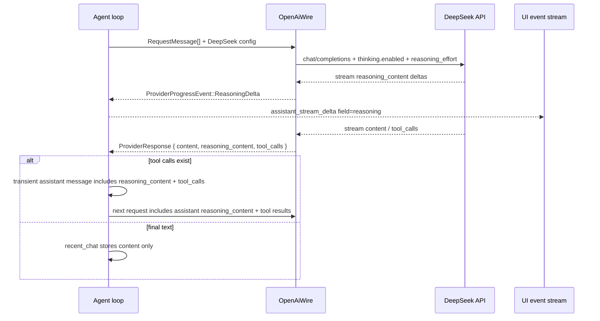

# DeepSeek Thinking Provider Design

> Stage 1 | 2026-04-25 | 上游：[deepseek-thinking-provider-brainstorm.md](deepseek-thinking-provider-brainstorm.md)
> 分卷：[接口契约](deepseek-thinking-provider-contracts.md) · [实现与测试](deepseek-thinking-provider-implementation.md)

## 0. 术语约定

| 术语 | 定义 | 防冲突结论 |
|---|---|---|
| **DeepSeek Thinking Mode** | DeepSeek 官方 OpenAI-compatible Chat Completions API 的思考模式，使用 `thinking: { type }` 控制开关，使用 `reasoning_effort` 控制强度。 | grep 命中集中在本 feature、`reasoning.md` 和 provider preset；现有架构里旧称是 DeepSeek-R1 / InlineTag，需要更新为官方 Thinking Mode。 |
| **`reasoning_content`** | DeepSeek assistant message / stream delta 中与 `content` 同级的可见思考内容。 | 代码里目前只在 `openai_message_text` fallback 里读取，容易把 reasoning 当正文；本 feature 明确它不是正文。 |
| **Visible Reasoning Delta** | provider 层向 agent/UI 发送的思考增量，对应 UI 事件 `assistant_stream_delta { field: "reasoning" }`。 | 前端和 UI 事件类型已经有 `reasoning` 字段；后端缺 `ProviderProgressEvent` / `AgentProgressEvent` 链路。 |
| **Turn-scoped provider history** | `AgentSession::run_agent_loop` 中的 `transient_messages`，只在当前 Turn 的多次 LLM 请求之间存在，Turn 结束后丢弃。 | 与 `recent_chat` 不冲突；DeepSeek tool-call 后必须回传的 reasoning 只能放在这里。 |
| **DeepSeek V4 models** | 官方当前模型 ID：`deepseek-v4-flash` / `deepseek-v4-pro`。 | 现有内置表仍有 `deepseek-chat` / `deepseek-coder`；`deepseek-chat` / `deepseek-reasoner` 作为兼容 alias 可保留但不再作为主推。 |

## 1. 决策与约束

### 需求摘要

**做什么**：把 DeepSeek 官方 OpenAI-compatible API 接成 March 的正式 provider 能力，覆盖：

1. 普通 DeepSeek chat 请求可用。
2. DeepSeek V4 Thinking Mode 请求体正确发送 `thinking` / `reasoning_effort`。
3. 流式和非流式响应都能把 `reasoning_content` 映射到 March 的 reasoning UI，而不是混入正文。
4. DeepSeek 在工具调用后的官方约束被满足：带 tool calls 的 assistant message 在当前 Turn 后续请求里完整回传 `reasoning_content`。
5. 内置 DeepSeek preset / 模型能力更新到官方 V4 模型。

**为谁**：March 用户和维护者。用户能在设置里选 DeepSeek provider 后正常跑 agentic coding；维护者能继续复用现有 OpenAI-compatible wire 层，不为 DeepSeek 复制一套 provider 分支。

**成功标准**：

1. DeepSeek preset 默认 base URL 为 `https://api.deepseek.com`，suggested models 主推 `deepseek-v4-flash` / `deepseek-v4-pro`。
2. `vendor_preset_id = "deepseek"` + Chat Completions 请求在 thinking 开启时包含：
   ```json
   {
     "thinking": { "type": "enabled" },
     "reasoning_effort": "high"
   }
   ```
3. DeepSeek stream chunk 中的 `delta.reasoning_content` 产生 `assistant_stream_delta { field: "reasoning" }`；`delta.content` 继续产生 `field: "content"`。
4. 非流式 response 的 `message.reasoning_content` 进入 `ProviderResponse.reasoning_content` 和 debug payload；如果这一轮最终无工具调用，最终写入 `recent_chat` 的仍只有 `content`。
5. 一轮 DeepSeek 工具调用链路中，第一次 assistant tool-call message 带回 `reasoning_content`；第二次 provider request 的 `messages` 中保留该字段，避免 400。
6. 单元测试覆盖 request body、stream parse、non-stream parse、tool-call transient message serialization；`cargo test -p march-core provider` 或等价定向测试通过。

**明确不做**：

- 不接 DeepSeek Anthropic API 格式；本 feature 只覆盖 OpenAI-compatible Chat Completions。
- 不新增 `Protocol::DeepSeek` 或独立 `DeepSeekWire`；DeepSeek 继续走 `Protocol::OpenAi`。
- 不做全局 reasoning 设置 UI 重做；只接入最小必要的 DeepSeek request 参数和后端/UI 事件链路。
- 不把 `reasoning_content` 写入 `recent_chat`、Notes、Memory 或最终 assistant text。
- 不支持 `<think>...</think>` fallback 的新解析器；本 feature 针对 DeepSeek 官方 `reasoning_content` 字段。旧 fallback 可留给后续通用 reasoning feature。
- 不在 Thinking Mode 下继续承诺 `temperature` / `top_p` / penalty 生效；DeepSeek thinking 请求不发送这些采样参数。

### 挂载点清单

- `crates/march-core/src/settings/vendor_preset.rs`：修改 DeepSeek preset 默认端点、suggested models、probe model。
- `src/lib/providerBaseUrl.ts`：修改 DeepSeek 设置页默认端点预览，保持前后端默认一致。
- `crates/march-core/src/model_capabilities.json`：修改/追加 DeepSeek V4 模型能力。
- `crates/march-core/src/provider.rs`：修改 `RuntimeProviderConfig` / `ProviderResponse` / `ProviderProgressEvent`，承载 reasoning 请求参数与响应内容。
- `crates/march-core/src/provider/messages.rs`：修改 `RequestMessage` / `RequestOptions`，承载 assistant `reasoning_content` 和 DeepSeek thinking request policy。
- `crates/march-core/src/provider/wire.rs`：修改 OpenAI Chat Completions request/response/stream parser，处理 `thinking`、`reasoning_effort`、`reasoning_content`。
- `crates/march-core/src/provider/wire/shared.rs`：修改 OpenAI message serialization / content parsing，禁止把 `reasoning_content` fallback 成正文。
- `crates/march-core/src/provider/delivery.rs`：修改 stream collector，分别累积 content 与 reasoning，并向上游发送 reasoning delta。
- `crates/march-core/src/agent/runner.rs`：修改 agent loop，把 provider reasoning delta 转成 agent event；tool-call 后追加 assistant transient message 时带回 reasoning。
- `crates/march-core/src/agent/prompting.rs`：修改 `append_assistant_tool_call_message` 签名，把 `reasoning_content` 写入轮内 assistant tool-call message。
- `crates/march-core/src/ui/backend/messaging.rs`：修改 agent event → UI event 和 persisted timeline reducer，写入 `PersistedAssistantMessage.reasoning`。
- `crates/march-core/src/ui/types/events.rs`：若新增 agent event 不影响 UI enum，则只复用现有 `UiAssistantStreamField::Reasoning`；不新增 UI event 类型。
- `codestable/architecture/reasoning.md`：更新 DeepSeek 行为为官方 Thinking Mode。
- `codestable/architecture/provider.md`：补充 DeepSeek 是 OpenAI ChatCompletions vendor-specific policy 的例子。
- `codestable/architecture/DESIGN.md`：把总入口里旧的“DeepSeek-R1 inline tag”表述更新为“DeepSeek Thinking Mode / reasoning_content”。

### 复杂度档位

本 feature 走“项目内部核心 provider 能力”档位，偏离默认内部工具组合如下：

- 健壮性 = L3（偏离默认 L2 的原因：provider wire format 是外部输入边界，解析错会导致正文丢失、tool loop 400 或 UI 误展示）
- 结构 = modules（偏离默认 functions 的原因：`delivery.rs` 551 行、`messages.rs` 490 行、`agent/runner.rs` 399 行，本 feature 若继续内联会加重职责混杂；需要把 reasoning parsing / serialization 的核心规则收敛到小 helper）
- 可测试性 = tested（偏离默认 testable 的原因：DeepSeek tool-call 回传约束靠人工 review 很难发现，必须有 request serialization 单测）
- 兼容性 = backward-compatible（新增 V4 主推模型时保留旧 `deepseek-chat` / `deepseek-reasoner` alias；用户已有 provider 不需要迁移）

### 关键决策

**决策 1：DeepSeek 不新增协议，只新增 vendor-specific Chat Completions policy**

DeepSeek 仍是 `Protocol::OpenAi` + `vendor_preset_id = "deepseek"`。OpenAI ChatCompletions adapter 在构建请求时读取 `RuntimeProviderConfig.vendor_preset_id`，只对 DeepSeek 插入 `thinking` / `reasoning_effort`，并在 Thinking Mode 下跳过不生效的采样参数。

被拒方案：新增 `Protocol::DeepSeek` 或 `DeepSeekWire`。这会破坏 provider 架构里“协议决定 wire adapter，厂牌决定兼容策略”的分层，后续每个 OpenAI-compatible 厂牌都会诱导新增 adapter。

**决策 2：新增显式 reasoning 字段，不再把 `reasoning_content` fallback 成正文**

现有 `openai_message_text` 在正文为空时会尝试读取 `reasoning_content`。本 feature 删除这条 fallback：`content` 只来自 `content`，`reasoning_content` 进入独立字段。这样才能保证 thinking 内容不会进入最终 assistant text / recent_chat。

**决策 3：轮内回传放在 `RequestMessage.reasoning_content`**

给 `RequestMessage` 增加：

```rust
pub struct RequestMessage {
    pub role: String,
    pub content: Option<MessageContent>,
    pub reasoning_content: Option<String>,
    pub tool_call_id: Option<String>,
    pub tool_calls: Vec<ApiToolCallRequest>,
}
```

OpenAI ChatCompletions 序列化 assistant message 时，如果 `reasoning_content` 非空，就写成：

```json
{
  "role": "assistant",
  "content": "...",
  "reasoning_content": "...",
  "tool_calls": [...]
}
```

该字段只在 Turn-scoped provider history 中使用；`build_messages(context)` 从 `recent_chat` 构造历史时不填它。

**决策 4：Provider / Agent / UI 三层都用显式 reasoning delta**

新增 `ProviderProgressEvent::ReasoningDelta(String)` 和 `AgentProgressEvent::AssistantReasoningPreview { message_id, delta }`。UI 层复用现有 `UiAssistantStreamField::Reasoning`。这样 DeepSeek stream path 和前端既有 reducer 对齐，不需要新 UI 事件。

**决策 5：非流式 reasoning 不伪装成 stream，但要补到 UI 和 debug**

非流式 fallback 没有实时 delta。provider 返回后，agent runner 在处理最终 response 时，如果 `response.reasoning_content` 非空且当前 message 的 reasoning preview 还没覆盖，就补发一次 `AssistantReasoningPreview`，类似现有 `flush_missing_assistant_text_delta`。debug payload 同时保留 `reasoning_content`，方便排查 DeepSeek 400。

**决策 6：DeepSeek thinking 请求默认启用 high**

本 feature 不做完整 reasoning UI，所以默认策略是：

- `vendor_preset_id = "deepseek"` 且模型为 `deepseek-v4-flash` / `deepseek-v4-pro`：发送 `thinking.enabled` 和 `reasoning_effort = "high"`。
- 若将来 task run params 支持 `reasoning_enabled=false`，OpenAI wire policy 直接映射为 `thinking.disabled`。
- 若将来 task run params 支持 `max`，OpenAI wire policy 直接映射为 `reasoning_effort = "max"`。

这让本 feature 先完整跑通 Thinking Mode + tool calls，同时不给 UI 大改背债。

**决策 7：工具调用参数增量不在本 feature 补**

现有 provider stream 已能发 `ToolCallsUpdated`，但 UI 事件里 `tool_call_arguments` 的逐片段展示没有完整接上。DeepSeek 正式可用不依赖 UI 实时展示 arguments；只要最终 tool call arguments 完整进入 `ProviderResponse.tool_calls` 即可。本 feature 不顺手重做工具参数流式 UI。

### 主流程概述



关键异常/边界：

- DeepSeek 返回 `reasoning_content` 但 `content` 为空且无 tool calls：不能把 reasoning 当最终回答；保持现有 “no tool calls and no text” 错误。
- DeepSeek 返回 tool calls 且 `reasoning_content` 为空：仍允许继续，按普通 OpenAI-compatible tool call 处理。
- stream 中同一 chunk 同时包含 `reasoning_content` 和 `content`：分别 emit 两个 delta，顺序为 reasoning 后 content，保证 UI 不丢字段。
- 非 DeepSeek OpenAI-compatible provider 返回 `reasoning_content`：解析为 reasoning delta / response 字段，但不发送 DeepSeek `thinking` request 参数。
